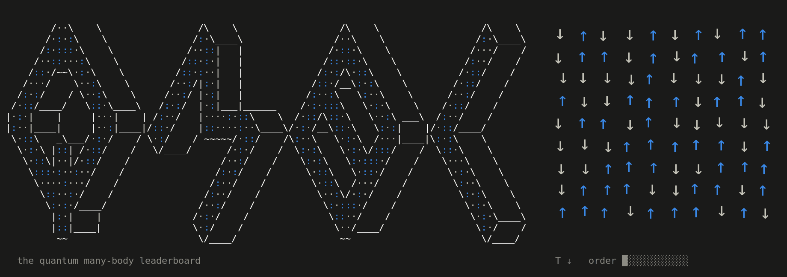

<!-- Header and footer animations are text-mode GIFs from scripts/ascii.mjs. -->

<!-- All badges via shields.io. Zenodo's own badge endpoint (zenodo.org/badge/DOI/....svg)
     returns 403 and renders as a broken image, so the DOI badge is built here instead. -->

SOTA ground-state energies.

This is the literature organised to serve fellow researchers and AI. 

So that we can see the works of the wider research community at one glance.

## Leaderboard

<!-- BEGIN LEADERBOARD (generated by scripts/readme_table.mjs - do not edit) -->

### All 341 Hamiltonian instances (click to unravel)

<b>Heisenberg</b>: 96 instances, energies as <code>E/N (S.S)</code>

| instance | record | method | closest challenger |
|---|---|---|---|
| chain, 20 sites, open | **-0.4341237** | Exact diagonalization [run script](https://github.com/varbench/methods/blob/main/scripts/Heisenberg/chain_20_O/ed_netket.sh), no paper cited | -0.4341237 (+<1e-7) DMRG (max truncation error ~... [run script](https://github.com/varbench/methods/blob/main/programs/dmrg_itensors_heisenberg/chain_20_O.jl), no paper cited |
| chain, 20 sites | **-0.4452193** | Exact diagonalization [run script](https://github.com/varbench/methods/blob/main/scripts/Heisenberg/chain_20_P/ed_netket.sh), no paper cited | -0.4452193 (+<1e-7) DMRG (max truncation error ~... [run script](https://github.com/varbench/methods/blob/main/programs/dmrg_itensors_heisenberg/chain_20_P.jl), no paper cited |
| chain, 200 sites, open | **-0.4422078** | DMRG (max truncation error ~ 1.0E-14) [run script](https://github.com/varbench/methods/blob/main/programs/dmrg_itensors_heisenberg/chain_200_O.jl), no paper cited | -0.4378396 (+4.4e-3) RBM (alpha = 1) [run script](https://github.com/varbench/methods/blob/main/scripts/Heisenberg/chain_200_O/vmc_rbm.sh), no paper cited |
| chain, 200 sites | **-0.4431678** | DMRG (max truncation error ~ 2.8E-12) [run script](https://github.com/varbench/methods/blob/main/programs/dmrg_itensors_heisenberg/chain_200_P.jl), no paper cited | -0.4430967 (+7.1e-5) VMC with projected fermions +... [run script](https://github.com/varbench/methods/blob/main/scripts/Heisenberg/chain_200_P/vmc_gutzwiller.sh), no paper cited |
| kagome-24, 24 sites | **-0.4412486** | Exact diagonalization (Lanczos) Lauchli, Sudan & Sorensen, Groun | none |
| kagome 2x2 (12 sites) | **-0.4537396** | Exact diagonalization (Lanczos) Lauchli, Sudan & Sorensen, Groun | none |
| kagome 2x3 (18 sites) | **-0.4471262** | Exact Diagonalization [run script](https://github.com/varbench/methods/blob/main/scripts/Heisenberg/kagome-2x3_18_P/ed_netket.sh), no paper cited | -0.4471262 (+<1e-7) DMRG (bond dimension = 368) [run script](https://github.com/varbench/methods/blob/main/scripts/Heisenberg/kagome-2x3_18_P/dmrg.sh), no paper cited |
| kagome-30, 30 sites | **-0.4384773** | Exact diagonalization (Lanczos) Lauchli, Sudan & Sorensen, Groun | none |
| kagome-36a, 36 sites | **-0.4385521** | Exact diagonalization (Lanczos) Lauchli, Sudan & Sorensen, Groun | none |
| kagome-36b, 36 sites | **-0.4390813** | Exact diagonalization (Lanczos) Lauchli, Sudan & Sorensen, Groun | none |
| kagome-36c, 36 sites | **-0.4392871** | Exact diagonalization (Lanczos) Lauchli, Sudan & Sorensen, Groun | none |
| kagome-36d, 36 sites | **-0.4383765** | Exact diagonalization (Lanczos) Lauchli, Sudan & Sorensen, Groun | none |
| kagome-42a, 42 sites | **-0.4379990** | Exact diagonalization (Lanczos) Lauchli, Sudan & Sorensen, Groun | none |
| kagome-42b, 42 sites | **-0.4381426** | Exact diagonalization (Lanczos) Lauchli, Sudan & Sorensen, Groun | none |
| kagome 4x4 (48 sites) | **-0.438703897156(2)** | Exact Diagonalization [Wietek & Läuchli (2018)](https://doi.org/10.1103/physreve.98.033309) | -0.437500000000 (+1.2e-3) GCNN (6 layers, 6 feature maps)... [Đurić et al. (2024)](https://doi.org/10.48550/arxiv.2401.02866) |
| kagome 6x6 (108 sites) | no record | every variational row is flagged | |
| kagome 8x8 (192 sites) | **-0.42987(1)** | VMC with Dirac spin liquid + Jastrow [run script](https://github.com/varbench/methods/blob/main/scripts/Heisenberg/kagome-8x8_192_P/vmc_gutzwiller.sh), no paper cited | -0.42868 (+1.2e-3) VMC, Gutzwiller-projected U(1)... He, Yu & Li, Phys. Rev. Lett. 13 |
| pyrochlore 2x2x2 (32 sites) | **-0.5168078** | Exact diagonalization [Astrakhantsev et al. (2021)](https://doi.org/10.1103/physrevx.11.041021) | -0.5162656 (+5.4e-4) mVMC with SU(2) and symmetry... [Astrakhantsev et al. (2021)](https://doi.org/10.1103/physrevx.11.041021) |
| pyrochlore 2x2x2 (128 sites) | **-0.49229(7)** | spin-parity mVMC-RBM/Lanczos (PP + RBM + 1st... [Pohle et al. (2023)](https://doi.org/10.48550/arxiv.2311.11561) | -0.49220 (+8.9e-5) mVMC (PP + RBM + 1st step Lanczos... [Pohle et al. (2023)](https://doi.org/10.48550/arxiv.2311.11561) |
| pyrochlore 3x3x3 (108 sites) | **-0.48711(9)** | mVMC with SU(2) and symmetry projections [Astrakhantsev et al. (2021)](https://doi.org/10.1103/physrevx.11.041021) | -0.48510 (+2.0e-3) DMRG [Hagymási et al. (2021)](https://doi.org/10.1103/physrevlett.126.117204) |
| pyrochlore 3x3x3 (432 sites) | **-0.48851(3)** | mVMC/Lanczos (PP + 1st Lanczos step... [Pohle et al. (2023)](https://doi.org/10.48550/arxiv.2311.11561) | -0.48847 (+3.5e-5) mVMC (PP + 1st step Lanczos... [Pohle et al. (2023)](https://doi.org/10.48550/arxiv.2311.11561) |
| pyrochlore 4x4x4 (256 sites) | **-0.48310(7)** | mVMC with SU(2) and symmetry projections [Astrakhantsev et al. (2021)](https://doi.org/10.1103/physrevx.11.041021) | none |
| pyrochlore 4x4x4 (1024 sites) | **-0.48800(1)** | mVMC (PP + 1st step Lanczos, spin-parity... [Pohle et al. (2023)](https://doi.org/10.48550/arxiv.2311.11561) | -0.48537 (+2.6e-3) mVMC (PP, spin-parity even, C3... [Pohle et al. (2023)](https://doi.org/10.48550/arxiv.2311.11561) |
| rectangular 10x20, periodic/open | **-0.3215152(2)** | SSE QMC (stochastic series expansion), T -> 0... [Sandvik (2026)](https://doi.org/10.48550/arxiv.2601.20189) | none |
| rectangular 12x24, periodic/open | **-0.3235928(2)** | SSE QMC (stochastic series expansion), T -> 0... [Sandvik (2026)](https://doi.org/10.48550/arxiv.2601.20189) | none |
| rectangular 14x28, periodic/open | **-0.3251197(2)** | SSE QMC (stochastic series expansion), T -> 0... [Sandvik (2026)](https://doi.org/10.48550/arxiv.2601.20189) | none |
| rectangular 16x32, periodic/open | **-0.3262843(2)** | SSE QMC (stochastic series expansion), T -> 0... [Sandvik (2026)](https://doi.org/10.48550/arxiv.2601.20189) | none |
| rectangular 18x36, periodic/open | **-0.3272005(2)** | SSE QMC (stochastic series expansion), T -> 0... [Sandvik (2026)](https://doi.org/10.48550/arxiv.2601.20189) | none |
| rectangular 20x40, periodic/open | **-0.3279389(2)** | SSE QMC (stochastic series expansion), T -> 0... [Sandvik (2026)](https://doi.org/10.48550/arxiv.2601.20189) | none |
| rectangular 24x48, periodic/open | **-0.3290543(3)** | SSE QMC (stochastic series expansion), T -> 0... [Sandvik (2026)](https://doi.org/10.48550/arxiv.2601.20189) | none |
| rectangular 32x64, periodic/open | **-0.3304607(3)** | SSE QMC (stochastic series expansion), T -> 0... [Sandvik (2026)](https://doi.org/10.48550/arxiv.2601.20189) | none |
| rectangular 48x96, periodic/open | **-0.3318764(3)** | SSE QMC (stochastic series expansion), T -> 0... [Sandvik (2026)](https://doi.org/10.48550/arxiv.2601.20189) | none |
| rectangular 4x8, periodic/open | **-0.3090818(2)** | SSE QMC (stochastic series expansion), T -> 0... [Sandvik (2026)](https://doi.org/10.48550/arxiv.2601.20189) | none |
| rectangular 64x128, periodic/open | **-0.3325865(2)** | SSE QMC (stochastic series expansion), T -> 0... [Sandvik (2026)](https://doi.org/10.48550/arxiv.2601.20189) | none |
| rectangular 6x12, periodic/open | **-0.3142222(2)** | SSE QMC (stochastic series expansion), T -> 0... [Sandvik (2026)](https://doi.org/10.48550/arxiv.2601.20189) | none |
| rectangular 6x8 | **-0.675986664017(2)** | Exact Diagonalization [Wietek & Läuchli (2018)](https://doi.org/10.1103/physreve.98.033309) | none |
| rectangular 8x16, periodic/open | **-0.3185609(2)** | SSE QMC (stochastic series expansion), T -> 0... [Sandvik (2026)](https://doi.org/10.48550/arxiv.2601.20189) | none |
| shuriken, 24 sites | **-0.4483290** | Exact diagonalization [Astrakhantsev et al. (2021)](https://doi.org/10.1103/physrevb.104.l220408) | none |
| shuriken, 96 sites | **-0.43826(1)** | mVMC with SU(2) and point group projection [Astrakhantsev et al. (2021)](https://doi.org/10.1103/physrevb.104.l220408) | none |
| shuriken, 216 sites | **-0.4376(1)** | mVMC with SU(2) and point group projection [Astrakhantsev et al. (2021)](https://doi.org/10.1103/physrevb.104.l220408) | none |
| shuriken, 384 sites | **-0.4371(1)** | mVMC with SU(2) and point group projection [Astrakhantsev et al. (2021)](https://doi.org/10.1103/physrevb.104.l220408) | none |
| square 4x4 | **-0.7017802** | Exact diagonalization [run script](https://github.com/varbench/methods/blob/main/scripts/Heisenberg/square_16_P/vqe.sh), no paper cited | -0.7017449 (+3.5e-5) VQE + symm. circuit (64 pars.... [run script](https://github.com/varbench/methods/blob/main/scripts/Heisenberg/square_16_P/vqe.sh), no paper cited |
| square 6x6, open | **-0.6035218** | Exact diagonalization [run script](https://github.com/varbench/methods/blob/main/scripts/Heisenberg/square_36_O/ed_lattice_symmetries.sh), no paper cited | -0.6035218 &#9675; (+<1e-7) DMRG keeping 4096 states (quoted... R.-Z. Huang, H.-J. Liao, Z.-Y. L |
| square 6x6 | **-0.6788721** | Exact diagonalization [run script](https://github.com/varbench/methods/blob/main/scripts/Heisenberg/square_36_P/ed_lattice_symmetries.sh), no paper cited | -0.6788710 (+1.1e-6) Grassmann Variational Monte Carlo... Grassmann Variational Monte Carl |
| square, 40 sites | **-0.6773713** | Exact diagonalization (Lanczos) Richter & Schulenburg, The spin- | none |
| square, 50 sites | **-0.675102038630(2)** | Exact Diagonalization [Wietek & Läuchli (2018)](https://doi.org/10.1103/physreve.98.033309) | none |
| square 8x8, open | **-0.6190371(2)** | SSE QMC (stochastic series expansion), T -> 0... [Sandvik (2026)](https://doi.org/10.48550/arxiv.2601.20189) | -0.6190330 (+4.1e-6) PEPS, GO method, D=10, Dc=20 Gradient optimization of finite  |
| square 8x8 | **-0.67349005(2)** | SSE QMC (stochastic series expansion), T -> 0... [Sandvik (2026)](https://doi.org/10.48550/arxiv.2601.20189) | -0.67348200 (+8.0e-6) RBM [Chen et al. (2022)](https://doi.org/10.48550/arxiv.2206.14307) |
| square 10x10, open | **-0.6286561(2)** | QMC (stochastic series expansion) [Sandvik (2026)](https://doi.org/10.48550/arxiv.2601.20189) | -0.6286560 (+<1e-7) 2D tensorized RNN (symmetry +... [Hibat-Allah et al. (2022)](https://doi.org/10.48550/arxiv.2207.14314) |
| square 10x10 | **-0.67155266(2)** | SSE QMC (stochastic series expansion), T -> 0... [Sandvik (2026)](https://doi.org/10.48550/arxiv.2601.20189) | -0.67155260 (+6.0e-8) CNN + MinSR [Chen & Heyl (2023)](https://doi.org/10.48550/arxiv.2302.01941) |
| square 12x12, open | **-0.6352007(2)** | SSE QMC (stochastic series expansion), T -> 0... [Sandvik (2026)](https://doi.org/10.48550/arxiv.2601.20189) | none |
| square 12x12 | **-0.67068192(2)** | SSE QMC (stochastic series expansion), T -> 0... [Sandvik (2026)](https://doi.org/10.48550/arxiv.2601.20189) | none |
| square 14x14, open | **-0.6399410(2)** | SSE QMC (stochastic series expansion), T -> 0... [Sandvik (2026)](https://doi.org/10.48550/arxiv.2601.20189) | none |
| square 14x14 | **-0.67023225(2)** | SSE QMC (stochastic series expansion), T -> 0... [Sandvik (2026)](https://doi.org/10.48550/arxiv.2601.20189) | -0.66834566 (+1.9e-3) VMC with fermions (flux+neel+Jastr... [run script](https://github.com/varbench/methods/blob/main/scripts/Heisenberg/square_196_P/vmc_gutzwiller.sh), no paper cited |
| square 16x16, open | **-0.6435317(2)** | QMC (stochastic series expansion) [Sandvik (2026)](https://doi.org/10.48550/arxiv.2601.20189) | -0.6435040 (+2.8e-5) 2D minGRU (3 layers, c4v symmetry... [Merali et al. (2026)](https://doi.org/10.48550/arxiv.2605.13807) |
| square 16x16 | **-0.66997660(2)** | SSE QMC (stochastic series expansion), T -> 0... [Sandvik (2026)](https://doi.org/10.48550/arxiv.2601.20189) | -0.66971600 (+2.6e-4) aCNN(C4v) Variational optimization of the  |
| square 18x18, open | **-0.6463451(4)** | SSE QMC (stochastic series expansion), T -> 0... [Sandvik (2026)](https://doi.org/10.48550/arxiv.2601.20189) | none |
| square 18x18 | **-0.66982043(2)** | SSE QMC (stochastic series expansion), T -> 0... [Sandvik (2026)](https://doi.org/10.48550/arxiv.2601.20189) | none |
| square 20x20, open | **-0.6486091(4)** | SSE QMC (stochastic series expansion), T -> 0... [Sandvik (2026)](https://doi.org/10.48550/arxiv.2601.20189) | none |
| square 20x20 | **-0.66971967(2)** | SSE QMC (stochastic series expansion), T -> 0... [Sandvik (2026)](https://doi.org/10.48550/arxiv.2601.20189) | none |
| square 22x22, open | **-0.6504689(4)** | SSE QMC (stochastic series expansion), T -> 0... [Sandvik (2026)](https://doi.org/10.48550/arxiv.2601.20189) | none |
| square 22x22 | **-0.66965176(2)** | SSE QMC (stochastic series expansion), T -> 0... [Sandvik (2026)](https://doi.org/10.48550/arxiv.2601.20189) | none |
| square 24x24, open | **-0.6520251(4)** | SSE QMC (stochastic series expansion), T -> 0... [Sandvik (2026)](https://doi.org/10.48550/arxiv.2601.20189) | none |
| square 24x24 | **-0.66960434(2)** | SSE QMC (stochastic series expansion), T -> 0... [Sandvik (2026)](https://doi.org/10.48550/arxiv.2601.20189) | -0.66923700 (+3.7e-4) aCNN(C4v) Variational optimization of the  |
| square 26x26, open | **-0.6533456(4)** | SSE QMC (stochastic series expansion), T -> 0... [Sandvik (2026)](https://doi.org/10.48550/arxiv.2601.20189) | none |
| square 26x26 | **-0.66957017(3)** | SSE QMC (stochastic series expansion), T -> 0... [Sandvik (2026)](https://doi.org/10.48550/arxiv.2601.20189) | none |
| square 28x28, open | **-0.6544806(4)** | SSE QMC (stochastic series expansion), T -> 0... [Sandvik (2026)](https://doi.org/10.48550/arxiv.2601.20189) | none |
| square 28x28 | **-0.66954496(3)** | SSE QMC (stochastic series expansion), T -> 0... [Sandvik (2026)](https://doi.org/10.48550/arxiv.2601.20189) | none |
| square 30x30 | **-0.66952595(3)** | SSE QMC (stochastic series expansion), T -> 0... [Sandvik (2026)](https://doi.org/10.48550/arxiv.2601.20189) | none |
| square 32x32, open | **-0.6563289(4)** | SSE QMC (stochastic series expansion), T -> 0... [Sandvik (2026)](https://doi.org/10.48550/arxiv.2601.20189) | none |
| square 32x32 | **-0.66951133(3)** | SSE QMC (stochastic series expansion), T -> 0... [Sandvik (2026)](https://doi.org/10.48550/arxiv.2601.20189) | none |
| square 36x36 | **-0.66949091(3)** | SSE QMC (stochastic series expansion), T -> 0... [Sandvik (2026)](https://doi.org/10.48550/arxiv.2601.20189) | none |
| square 40x40 | **-0.66947776(3)** | SSE QMC (stochastic series expansion), T -> 0... [Sandvik (2026)](https://doi.org/10.48550/arxiv.2601.20189) | none |
| square 44x44 | **-0.66946889(3)** | SSE QMC (stochastic series expansion), T -> 0... [Sandvik (2026)](https://doi.org/10.48550/arxiv.2601.20189) | none |
| square 48x48, open | **-0.6606690(4)** | SSE QMC (stochastic series expansion), T -> 0... [Sandvik (2026)](https://doi.org/10.48550/arxiv.2601.20189) | none |
| square 48x48 | **-0.66946274(3)** | SSE QMC (stochastic series expansion), T -> 0... [Sandvik (2026)](https://doi.org/10.48550/arxiv.2601.20189) | none |
| square 52x52 | **-0.66945833(3)** | SSE QMC (stochastic series expansion), T -> 0... [Sandvik (2026)](https://doi.org/10.48550/arxiv.2601.20189) | none |
| square 56x56 | **-0.66945502(3)** | SSE QMC (stochastic series expansion), T -> 0... [Sandvik (2026)](https://doi.org/10.48550/arxiv.2601.20189) | none |
| square 60x60 | **-0.66945260(3)** | SSE QMC (stochastic series expansion), T -> 0... [Sandvik (2026)](https://doi.org/10.48550/arxiv.2601.20189) | none |
| square 64x64, open | **-0.6628515(4)** | SSE QMC (stochastic series expansion), T -> 0... [Sandvik (2026)](https://doi.org/10.48550/arxiv.2601.20189) | none |
| square 64x64 | **-0.66945072(3)** | SSE QMC (stochastic series expansion), T -> 0... [Sandvik (2026)](https://doi.org/10.48550/arxiv.2601.20189) | none |
| square 72x72 | **-0.66944815(3)** | SSE QMC (stochastic series expansion), T -> 0... [Sandvik (2026)](https://doi.org/10.48550/arxiv.2601.20189) | none |
| square 80x80 | **-0.66944645(3)** | SSE QMC (stochastic series expansion), T -> 0... [Sandvik (2026)](https://doi.org/10.48550/arxiv.2601.20189) | none |
| square 88x88 | **-0.66944530(3)** | SSE QMC (stochastic series expansion), T -> 0... [Sandvik (2026)](https://doi.org/10.48550/arxiv.2601.20189) | none |
| square 96x96, open | **-0.6650415(2)** | SSE QMC (stochastic series expansion), T -> 0... [Sandvik (2026)](https://doi.org/10.48550/arxiv.2601.20189) | none |
| square 96x96 | **-0.66944454(3)** | SSE QMC (stochastic series expansion), T -> 0... [Sandvik (2026)](https://doi.org/10.48550/arxiv.2601.20189) | none |
| square 128x128, open | **-0.6661389(2)** | SSE QMC (stochastic series expansion), T -> 0... [Sandvik (2026)](https://doi.org/10.48550/arxiv.2601.20189) | none |
| triangular 4x4 | **-0.5347197** | Exact diagonalization [run script](https://github.com/varbench/methods/blob/main/scripts/Heisenberg/triangular_16_P/ed_netket.sh), no paper cited | -0.5340324 (+6.9e-4) VQE (SR + symm. + 64 par) [run script](https://github.com/varbench/methods/blob/main/scripts/Heisenberg/triangular_16_P/vqe.sh), no paper cited |
| triangular 6x6 | **-0.5603734** | Exact diagonalization [run script](https://github.com/varbench/methods/blob/main/scripts/Heisenberg/triangular_36_P/ed_lattice_symmetries.sh), no paper cited | -0.5603130 (+6.0e-5) Group CNN (deep, symmetry-projecte... [Roth et al. (2022)](https://doi.org/10.48550/arxiv.2211.07749) |
| triangular, 48 sites | **-0.558603026490(2)** | Exact Diagonalization [Wietek & Läuchli (2018)](https://doi.org/10.1103/physreve.98.033309) | none |
| triangular 10x10, open | **-0.5147668** | DMRG (bond dimension = 4096) [run script](https://github.com/varbench/methods/blob/main/scripts/Heisenberg/triangular_100_O/dmrg.sh), no paper cited | -0.5138630 (+9.0e-4) Tensor-RNN (bond dimension = 40) [Wu et al. (2023)](https://doi.org/10.1103/physrevresearch.5.l032001) |
| triangular, 108 sites | **-0.55315(3)** | GCNN (deep group-equivariant CNN) [Roth et al. (2022)](https://doi.org/10.48550/arxiv.2211.07749) | -0.55190 (+1.2e-3) Graph neural network [Kochkov et al. (2021)](https://doi.org/10.48550/arxiv.2110.06390) |
| triangular 12x12, open | **-0.5150648** | DMRG (Bond dimension = 3000) [run script](https://github.com/varbench/methods/blob/main/programs/dmrg_itensor_cpp/dmrg_triangular_heisenberg_12x12.cc), no paper cited | -0.5119722 (+3.1e-3) 2D Gated RNN [Hibat-Allah et al. (2022)](https://doi.org/10.48550/arxiv.2207.14314) |
| triangular 12x12 | **-0.54624(2)** | VMC with Dirac+field+Jastrow [run script](https://github.com/varbench/methods/blob/main/scripts/Heisenberg/triangular_144_P/vmc_gutzwiller.sh), no paper cited | -0.48966 (+5.7e-2) RBM (alpha = 1) [run script](https://github.com/varbench/methods/blob/main/scripts/Heisenberg/triangular_144_P/vmc_rbm.sh), no paper cited |
| triangular 14x14, open | **-0.5138(1)** | 2D Gated RNN [Hibat-Allah et al. (2022)](https://doi.org/10.48550/arxiv.2207.14314) | -0.5108 (+3.0e-3) DMRG (Bond dimension = 2000) [run script](https://github.com/varbench/methods/blob/main/programs/dmrg_itensor_cpp/dmrg_triangular_heisenberg_14x14.cc), no paper cited |
| triangular 16x16, open | **-0.51668(9)** | 2D Gated RNN [Hibat-Allah et al. (2022)](https://doi.org/10.48550/arxiv.2207.14314) | -0.50797 (+8.7e-3) DMRG (Bond dimension = 2000) [run script](https://github.com/varbench/methods/blob/main/programs/dmrg_itensor_cpp/dmrg_triangular_heisenberg_16x16.cc), no paper cited |

<b>J1-J2</b>: 72 instances, energies as <code>E/N (S.S)</code>

| instance | record | method | closest challenger |
|---|---|---|---|
| rectangular 4x6, J2 = 0.5 | **-0.5225249** | Exact diagonalization [run script](https://github.com/varbench/methods/blob/main/scripts/J1J2/rectangular-4x6_24_P_0.5/ed_lattice_symmetries.sh), no paper cited | -0.5225249 (+<1e-7) DMRG (bond dimension = 4096) [run script](https://github.com/varbench/methods/blob/main/scripts/J1J2/rectangular-4x6_24_P_0.5/dmrg.sh), no paper cited |
| square 4x4, J2 = 0.05 | **-0.6805900** | Exact diagonalization [run script](https://github.com/varbench/methods/blob/main/scripts/J1J2/square_16_P_0.05/ed_netket.sh), no paper cited | -0.6805657 (+2.4e-5) VQE + symm. circuit (64 pars.... [run script](https://github.com/varbench/methods/blob/main/scripts/J1J2/square_16_P_0.05/vqe.sh), no paper cited |
| square 4x4, J2 = 0.1 | **-0.6598172** | Exact diagonalization [run script](https://github.com/varbench/methods/blob/main/scripts/J1J2/square_16_P_0.1/ed_netket.sh), no paper cited | -0.6597832 (+3.4e-5) VQE + symm. circuit (64 pars.... [run script](https://github.com/varbench/methods/blob/main/scripts/J1J2/square_16_P_0.1/vqe.sh), no paper cited |
| square 4x4, J2 = 0.15 | **-0.6395429** | Exact diagonalization [run script](https://github.com/varbench/methods/blob/main/scripts/J1J2/square_16_P_0.15/ed_netket.sh), no paper cited | -0.6395107 &dagger; (+3.2e-5) VQE + symm. circuit (64 pars.... [run script](https://github.com/varbench/methods/blob/main/scripts/J1J2/square_16_P_0.15/vqe_noisy.sh), no paper cited |
| square 4x4, J2 = 0.2 | **-0.6198739** | Exact diagonalization [run script](https://github.com/varbench/methods/blob/main/scripts/J1J2/square_16_P_0.2/ed_netket.sh), no paper cited | -0.6198639 (+1.0e-5) VQE + symm. circuit (64 pars.... [run script](https://github.com/varbench/methods/blob/main/scripts/J1J2/square_16_P_0.2/vqe.sh), no paper cited |
| square 4x4, J2 = 0.25 | **-0.6009545** | Exact diagonalization [run script](https://github.com/varbench/methods/blob/main/scripts/J1J2/square_16_P_0.25/ed_netket.sh), no paper cited | -0.6009332 (+2.1e-5) VQE + symm. circuit (64 pars.... [run script](https://github.com/varbench/methods/blob/main/scripts/J1J2/square_16_P_0.25/vqe.sh), no paper cited |
| square 4x4, J2 = 0.3 | **-0.5829838** | Exact diagonalization [run script](https://github.com/varbench/methods/blob/main/scripts/J1J2/square_16_P_0.3/ed_netket.sh), no paper cited | -0.5829522 &dagger; (+3.2e-5) VQE + symm. circuit (64 pars.... [run script](https://github.com/varbench/methods/blob/main/scripts/J1J2/square_16_P_0.3/vqe_noisy.sh), no paper cited |
| square 4x4, J2 = 0.35 | **-0.5662448** | Exact diagonalization [run script](https://github.com/varbench/methods/blob/main/scripts/J1J2/square_16_P_0.35/ed_netket.sh), no paper cited | -0.5662285 (+1.6e-5) VQE + symm. circuit (64 pars.... [run script](https://github.com/varbench/methods/blob/main/scripts/J1J2/square_16_P_0.35/vqe.sh), no paper cited |
| square 4x4, J2 = 0.4 | **-0.5511478** | Exact diagonalization [run script](https://github.com/varbench/methods/blob/main/scripts/J1J2/square_16_P_0.4/ed_netket.sh), no paper cited | -0.5511135 &dagger; (+3.4e-5) VQE + symm. circuit (64 pars.... [run script](https://github.com/varbench/methods/blob/main/scripts/J1J2/square_16_P_0.4/vqe_noisy.sh), no paper cited |
| square 4x4, J2 = 0.45 | **-0.5382998** | Exact diagonalization [run script](https://github.com/varbench/methods/blob/main/scripts/J1J2/square_16_P_0.45/ed_netket.sh), no paper cited | -0.5382766 (+2.3e-5) VQE + symm. circuit (64 pars.... [run script](https://github.com/varbench/methods/blob/main/scripts/J1J2/square_16_P_0.45/vqe.sh), no paper cited |
| square 4x4, J2 = 0.5 | **-0.5286202** | Exact diagonalization [run script](https://github.com/varbench/methods/blob/main/scripts/J1J2/square_16_P_0.5/ed_netket.sh), no paper cited | -0.5286173 (+2.9e-6) VQE + symm. circuit (64 pars.... [run script](https://github.com/varbench/methods/blob/main/scripts/J1J2/square_16_P_0.5/vqe.sh), no paper cited |
| square 4x4, J2 = 0.6 | **-0.5258958** | Exact diagonalization [run script](https://github.com/varbench/methods/blob/main/scripts/J1J2/square_16_P_0.6/ed_netket.sh), no paper cited | -0.5258158 (+8.0e-5) VQE + symm. circuit (64 pars.... [run script](https://github.com/varbench/methods/blob/main/scripts/J1J2/square_16_P_0.6/vqe.sh), no paper cited |
| square 4x4, J2 = 0.65 | **-0.5393825** | Exact diagonalization [run script](https://github.com/varbench/methods/blob/main/scripts/J1J2/square_16_P_0.65/ed_netket.sh), no paper cited | -0.5393444 (+3.8e-5) VQE + symm. circuit (64 pars.... [run script](https://github.com/varbench/methods/blob/main/scripts/J1J2/square_16_P_0.65/vqe.sh), no paper cited |
| square 4x4, J2 = 0.7 | **-0.5638581** | Exact diagonalization [run script](https://github.com/varbench/methods/blob/main/scripts/J1J2/square_16_P_0.7/ed_netket.sh), no paper cited | -0.5637716 &dagger; (+8.7e-5) VQE + symm. circuit (64 pars.... [run script](https://github.com/varbench/methods/blob/main/scripts/J1J2/square_16_P_0.7/vqe_noisy.sh), no paper cited |
| square 4x4, J2 = 0.75 | **-0.5942731** | Exact diagonalization [run script](https://github.com/varbench/methods/blob/main/scripts/J1J2/square_16_P_0.75/ed_netket.sh), no paper cited | -0.5942152 (+5.8e-5) VQE + symm. circuit (64 pars.... [run script](https://github.com/varbench/methods/blob/main/scripts/J1J2/square_16_P_0.75/vqe.sh), no paper cited |
| square 4x4, J2 = 0.8 | **-0.6273351** | Exact diagonalization [run script](https://github.com/varbench/methods/blob/main/scripts/J1J2/square_16_P_0.8/ed_netket.sh), no paper cited | -0.6273137 (+2.1e-5) VQE + symm. circuit (64 pars.... [run script](https://github.com/varbench/methods/blob/main/scripts/J1J2/square_16_P_0.8/vqe.sh), no paper cited |
| square 4x4, J2 = 0.85 | **-0.6617197** | Exact diagonalization [run script](https://github.com/varbench/methods/blob/main/scripts/J1J2/square_16_P_0.85/ed_netket.sh), no paper cited | -0.6617069 (+1.3e-5) VQE + symm. circuit (64 pars.... [run script](https://github.com/varbench/methods/blob/main/scripts/J1J2/square_16_P_0.85/vqe.sh), no paper cited |
| square 4x4, J2 = 0.9 | **-0.6968656** | Exact diagonalization [run script](https://github.com/varbench/methods/blob/main/scripts/J1J2/square_16_P_0.9/ed_netket.sh), no paper cited | -0.6967967 (+6.9e-5) VQE + symm. circuit (64 pars.... [run script](https://github.com/varbench/methods/blob/main/scripts/J1J2/square_16_P_0.9/vqe.sh), no paper cited |
| square 4x4, J2 = 0.95 | **-0.7324989** | Exact diagonalization [run script](https://github.com/varbench/methods/blob/main/scripts/J1J2/square_16_P_0.95/ed_netket.sh), no paper cited | -0.7324804 (+1.8e-5) VQE + symm. circuit (64 pars.... [run script](https://github.com/varbench/methods/blob/main/scripts/J1J2/square_16_P_0.95/vqe.sh), no paper cited |
| square 4x4, J2 = 1 | **-0.7684681** | Exact diagonalization [run script](https://github.com/varbench/methods/blob/main/scripts/J1J2/square_16_P_1.0/ed_netket.sh), no paper cited | -0.7684501 (+1.8e-5) VQE + symm. circuit (64 pars.... [run script](https://github.com/varbench/methods/blob/main/scripts/J1J2/square_16_P_1.0/vqe.sh), no paper cited |
| square 6x6, J2 = 0.3 | **-0.5624595** | Exact diagonalization [run script](https://github.com/varbench/methods/blob/main/scripts/J1J2/square_36_P_0.3/ed_lattice_symmetries.sh), no paper cited | -0.5624530 &#9675; (+6.5e-6) ViT Extremely slow scaling of minima |
| square 6x6, J2 = 0.4 | **-0.5297450** | Exact diagonalization [run script](https://github.com/varbench/methods/blob/main/scripts/J1J2/square_36_P_0.4/ed_lattice_symmetries.sh), no paper cited | -0.5297440 &#9675; (+1.0e-6) DMRG on the L x L torus, 8192... Gong, Zhu, Sheng, Motrunich & Fi |
| square 6x6, J2 = 0.45 | **-0.5156550** &#9675; | DMRG on the L x L torus, 8192 SU(2) states Gong, Zhu, Sheng, Motrunich & Fi | -0.5156520 &#9675; (+3.0e-6) DMRG on the L x L torus, 6144... Gong, Zhu, Sheng, Motrunich & Fi |
| square 6x6, J2 = 0.5 | **-0.5038097** | Exact diagonalization [run script](https://github.com/varbench/methods/blob/main/scripts/J1J2/square_36_P_0.5/ed_lattice_symmetries.sh), no paper cited | -0.5038050 &#9675; (+4.7e-6) DMRG on the L x L torus, 8192... Gong, Zhu, Sheng, Motrunich & Fi |
| square 6x6, J2 = 0.55 | **-0.4951670** &#9675; | DMRG on the L x L torus, 8192 SU(2) states Gong, Zhu, Sheng, Motrunich & Fi | -0.4951500 &#9675; (+1.7e-5) DMRG on the L x L torus, 6144... Gong, Zhu, Sheng, Motrunich & Fi |
| square 6x6, J2 = 0.6 | **-0.4932386** | Exact diagonalization [run script](https://github.com/varbench/methods/blob/main/scripts/J1J2/square_36_P_0.6/ed_lattice_symmetries.sh), no paper cited | -0.4931800 (+5.9e-5) RBM wave function + 2-step... [Chen et al. (2022)](https://doi.org/10.48550/arxiv.2206.14307) |
| square 6x6, J2 = 0.7 | **-0.5300012** | Exact diagonalization [run script](https://github.com/varbench/methods/blob/main/scripts/J1J2/square_36_P_0.7/ed_lattice_symmetries.sh), no paper cited | -0.5299243 (+7.7e-5) DMRG (bond dimension = 2048) [run script](https://github.com/varbench/methods/blob/main/scripts/J1J2/square_36_P_0.7/dmrg.sh), no paper cited |
| square 6x6, J2 = 0.8 | **-0.5864866** | Exact diagonalization [run script](https://github.com/varbench/methods/blob/main/scripts/J1J2/square_36_P_0.8/ed_lattice_symmetries.sh), no paper cited | -0.5864110 (+7.6e-5) RBM wave function [Chen et al. (2022)](https://doi.org/10.48550/arxiv.2206.14307) |
| square 6x6, J2 = 0.9 | **-0.6490520** | Exact diagonalization [run script](https://github.com/varbench/methods/blob/main/scripts/J1J2/square_36_P_0.9/ed_lattice_symmetries.sh), no paper cited | -0.6478705 (+1.2e-3) DMRG (bond dimension = 2048) [run script](https://github.com/varbench/methods/blob/main/scripts/J1J2/square_36_P_0.9/dmrg.sh), no paper cited |
| square 6x6, J2 = 1 | **-0.7143604** | Exact diagonalization [run script](https://github.com/varbench/methods/blob/main/scripts/J1J2/square_36_P_1/ed_lattice_symmetries.sh), no paper cited | -0.7142900 (+7.0e-5) RBM wave function [Chen et al. (2022)](https://doi.org/10.48550/arxiv.2206.14307) |
| square, 40 sites, J2 = 0.1 | **-0.6366151** | Exact diagonalization (Lanczos) Richter & Schulenburg, The spin- | none |
| square, 40 sites, J2 = 0.2 | **-0.5975117** | Exact diagonalization (Lanczos) Richter & Schulenburg, The spin- | none |
| square, 40 sites, J2 = 0.3 | **-0.5606822** | Exact diagonalization (Lanczos) Richter & Schulenburg, The spin- | none |
| square, 40 sites, J2 = 0.4 | **-0.5272092** | Exact diagonalization (Lanczos) Richter & Schulenburg, The spin- | none |
| square, 40 sites, J2 = 0.5 | **-0.4990762** | Exact diagonalization (Lanczos) Richter & Schulenburg, The spin- | none |
| square, 40 sites, J2 = 0.55 | **-0.4879479** | Exact diagonalization (Lanczos) Richter & Schulenburg, The spin- | none |
| square, 40 sites, J2 = 0.6 | **-0.4795920** | Exact diagonalization (Lanczos) Richter & Schulenburg, The spin- | none |
| square, 40 sites, J2 = 0.65 | **-0.5011508** | Exact diagonalization (Lanczos) Richter & Schulenburg, The spin- | none |
| square, 40 sites, J2 = 0.7 | **-0.5263826** | Exact diagonalization (Lanczos) Richter & Schulenburg, The spin- | none |
| square, 40 sites, J2 = 0.8 | **-0.5835051** | Exact diagonalization (Lanczos) Richter & Schulenburg, The spin- | none |
| square, 40 sites, J2 = 0.9 | **-0.6459228** | Exact diagonalization (Lanczos) Richter & Schulenburg, The spin- | none |
| square, 40 sites, J2 = 1 | **-0.7109702** | Exact diagonalization (Lanczos) Richter & Schulenburg, The spin- | none |
| square 8x8, J2 = 0.4 | **-0.52539(1)** | VMC + 2 Lanczos steps Hu, Becca, Parola & Sorella, Dir | -0.52520 &#9675; (+1.9e-4) DMRG on the L x L torus, 8192... Gong, Zhu, Sheng, Motrunich & Fi |
| square 8x8, J2 = 0.45 | **-0.51125(1)** | VMC + 2 Lanczos steps Hu, Becca, Parola & Sorella, Dir | -0.51101 (+2.4e-4) VMC + 1 Lanczos step Hu, Becca, Parola & Sorella, Dir |
| square 8x8, J2 = 0.5 | **-0.498963(2)** | RBM+PP with momentum (K=0), spin-parity (even... [Nomura & Imada (2021)](https://doi.org/10.1103/physrevx.11.031034) | -0.498860 (+1.0e-4) VMC + 2 Lanczos steps Hu, Becca, Parola & Sorella, Dir |
| square 8x8, J2 = 0.55 | **-0.48841(2)** | VMC + 2 Lanczos steps Hu, Becca, Parola & Sorella, Dir | -0.48835 (+6.0e-5) ClebschTree [Vieijra & Nys (2021)](https://doi.org/10.1103/physrevb.104.045123) |
| square 10x10, J2 = 0.3 | **-0.55485(1)** | VMC with fermions (flux+neel+Jastrow) [run script](https://github.com/varbench/methods/blob/main/scripts/J1J2/square_100_P_0.3/vmc_gutzwiller.sh), no paper cited | -0.54909 (+5.8e-3) DMRG (bond dimension = 1024) [run script](https://github.com/varbench/methods/blob/main/scripts/J1J2/square_100_P_0.3/dmrg.sh), no paper cited |
| square 10x10, J2 = 0.4 | **-0.5240(1)** | VMC + 2 Lanczos steps Hu, Becca, Parola & Sorella, Dir | -0.5239 (+1.2e-4) RBM wave function [Chen et al. (2022)](https://doi.org/10.48550/arxiv.2206.14307) |
| square 10x10, J2 = 0.45 | **-0.51001(1)** | VMC + 2 Lanczos steps Hu, Becca, Parola & Sorella, Dir | -0.50973 (+2.8e-4) VMC + 1 Lanczos step Hu, Becca, Parola & Sorella, Dir |
| square 10x10, J2 = 0.5 | **-0.4976939(2)** | CNN-MPS (h,D,l)=(32,20,20), Marshall sign... [Fan et al. (2026)](https://doi.org/10.48550/arxiv.2603.14425) | -0.4976923 (+1.6e-6) T-MPS [Fan et al. (2026)](https://doi.org/10.48550/arxiv.2603.14425) |
| square 10x10, J2 = 0.55 | **-0.48693(3)** | VMC + 2 Lanczos steps Hu, Becca, Parola & Sorella, Dir | -0.48677 (+1.6e-4) GCNN (deep group-convolutional... [Roth et al. (2022)](https://doi.org/10.48550/arxiv.2211.07749) |
| square 10x10, J2 = 0.6 | **-0.4774611** | DMRG (bond dimension = 1024) [run script](https://github.com/varbench/methods/blob/main/scripts/J1J2/square_100_P_0.6/dmrg.sh), no paper cited | -0.4766200 (+8.4e-4) RBM wave function [Chen et al. (2022)](https://doi.org/10.48550/arxiv.2206.14307) |
| square 10x10, J2 = 0.7 | **-0.51889(2)** | RBM wave function [Chen et al. (2022)](https://doi.org/10.48550/arxiv.2206.14307) | -0.51643 (+2.5e-3) DMRG (bond dimension = 1024) [run script](https://github.com/varbench/methods/blob/main/scripts/J1J2/square_100_P_0.7/dmrg.sh), no paper cited |
| square 10x10, J2 = 0.8 | **-0.57404(2)** | RBM wave function [Chen et al. (2022)](https://doi.org/10.48550/arxiv.2206.14307) | -0.57383 (+2.1e-4) CNN Choo, Neupert & Carleo, Two-dime |
| square 10x10, J2 = 0.9 | **-0.6269664** | DMRG (bond dimension = 1024) [run script](https://github.com/varbench/methods/blob/main/scripts/J1J2/square_100_P_0.9/dmrg.sh), no paper cited | -0.5974150 (+3.0e-2) RBM (alpha = 1) [run script](https://github.com/varbench/methods/blob/main/scripts/J1J2/square_100_P_0.9/vmc_rbm.sh), no paper cited |
| square 10x10, J2 = 1 | **-0.69670(2)** | RBM wave function [Chen et al. (2022)](https://doi.org/10.48550/arxiv.2206.14307) | -0.69664 &#9675; (+5.9e-5) ViT Extremely slow scaling of minima |
| square 12x12, J2 = 0.5 | **-0.496791(4)** | mVMC + RBM (as quoted) [Roth et al. (2022)](https://doi.org/10.48550/arxiv.2211.07749) | -0.496769 (+2.2e-5) GCNN (deep group-convolutional... [Roth et al. (2022)](https://doi.org/10.48550/arxiv.2211.07749) |
| square 12x12, J2 = 0.55 | **-0.48607(1)** | GCNN (deep group-convolutional network) [Roth et al. (2022)](https://doi.org/10.48550/arxiv.2211.07749) | -0.48574 (+3.3e-4) mVMC + RBM (as quoted) [Roth et al. (2022)](https://doi.org/10.48550/arxiv.2211.07749) |
| square 14x14, J2 = 0.4 | **-0.52287(1)** | VMC + 1 Lanczos step Hu, Becca, Parola & Sorella, Dir | -0.52124 (+1.6e-3) VMC, p = 0 Lanczos steps Hu, Becca, Parola & Sorella, Dir |
| square 14x14, J2 = 0.45 | **-0.50899(1)** | VMC + 1 Lanczos step Hu, Becca, Parola & Sorella, Dir | -0.50745 (+1.5e-3) VMC, p = 0 Lanczos steps Hu, Becca, Parola & Sorella, Dir |
| square 14x14, J2 = 0.5 | **-0.49638(1)** | VMC + 1 Lanczos step Hu, Becca, Parola & Sorella, Dir | -0.49447 (+1.9e-3) VMC, p = 0 Lanczos steps Hu, Becca, Parola & Sorella, Dir |
| square 14x14, J2 = 0.55 | **-0.48519(1)** | VMC + 1 Lanczos step Hu, Becca, Parola & Sorella, Dir | -0.48242 (+2.8e-3) VMC, p = 0 Lanczos steps Hu, Becca, Parola & Sorella, Dir |
| square 16x16, J2 = 0.5 | **-0.4969140(5)** | CNN-MPS [Fan et al. (2026)](https://doi.org/10.48550/arxiv.2603.14425) | -0.4967860 (+1.3e-4) T-MPS [Fan et al. (2026)](https://doi.org/10.48550/arxiv.2603.14425) |
| square 16x16, J2 = 0.55 | **-0.485583(8)** | GCNN (deep group-convolutional network) [Roth et al. (2022)](https://doi.org/10.48550/arxiv.2211.07749) | -0.485208 (+3.8e-4) mVMC + RBM (as quoted) [Roth et al. (2022)](https://doi.org/10.48550/arxiv.2211.07749) |
| square 18x18, J2 = 0.4 | **-0.52259(1)** | VMC + 1 Lanczos step Hu, Becca, Parola & Sorella, Dir | -0.52107 (+1.5e-3) VMC, p = 0 Lanczos steps Hu, Becca, Parola & Sorella, Dir |
| square 18x18, J2 = 0.45 | **-0.50874(1)** | VMC + 1 Lanczos step Hu, Becca, Parola & Sorella, Dir | -0.50728 (+1.5e-3) VMC, p = 0 Lanczos steps Hu, Becca, Parola & Sorella, Dir |
| square 18x18, J2 = 0.5 | **-0.49611(1)** | VMC + 1 Lanczos step Hu, Becca, Parola & Sorella, Dir | -0.49426 (+1.9e-3) VMC, p = 0 Lanczos steps Hu, Becca, Parola & Sorella, Dir |
| square 18x18, J2 = 0.55 | **-0.48475(1)** | VMC + 1 Lanczos step Hu, Becca, Parola & Sorella, Dir | -0.48215 (+2.6e-3) VMC, p = 0 Lanczos steps Hu, Becca, Parola & Sorella, Dir |
| square 20x20, J2 = 0.5 | **-0.4967987(6)** | CNN-MPS (h,D,l)=(32,15,20) [Fan et al. (2026)](https://doi.org/10.48550/arxiv.2603.14425) | -0.4967320 (+6.7e-5) ViT with symmetry restoration [Viteritti et al. (2026)](https://doi.org/10.48550/arxiv.2602.02665) |
| triangular, 48 sites, J2 = 0.125 | **-0.517314443433854(2)** | Exact Diagonalization Gamma.D6.A1 1 [Wietek et al. (2024)](https://doi.org/10.1103/physrevx.14.021010) | none |
| triangular, 108 sites, J2 = 0.125 | **-0.51268(9)** | GCNN + Lanczos step [Roth et al. (2022)](https://doi.org/10.48550/arxiv.2211.07749) | -0.51175 (+9.3e-4) GCNN (deep group-equivariant CNN) [Roth et al. (2022)](https://doi.org/10.48550/arxiv.2211.07749) |
| triangular 12x12, J2 = 0.125 | **-0.51218(9)** | GCNN + Lanczos step [Roth et al. (2022)](https://doi.org/10.48550/arxiv.2211.07749) | -0.51101 (+1.2e-3) GCNN (deep group-equivariant CNN) [Roth et al. (2022)](https://doi.org/10.48550/arxiv.2211.07749) |

<b>Hubbard</b>: 140 instances, energies as <code>E/site</code>

| instance | record | method | closest challenger |
|---|---|---|---|
| chain, 14 sites, U = 1, n &asymp; 0.5714 | **-0.9116302** | Exact diagonalization [run script](https://github.com/varbench/methods/blob/main/scripts/Hubbard/chain_14_P_4_1/ed_netket.sh), no paper cited | -0.9116293 (+9.1e-7) DMRG (MaxBondDim = 1550, Extrap... [run script](https://github.com/varbench/methods/blob/main/programs/dmrg_itensors_hubbard/chain_14_P_4_1.jl), no paper cited |
| chain, 14 sites, U = 1.66810054, n &asymp; 0.5714 | **-0.8761535** | Exact diagonalization [run script](https://github.com/varbench/methods/blob/main/scripts/Hubbard/chain_14_P_4_1.66810054/ed_netket.sh), no paper cited | none |
| chain, 14 sites, U = 2.15443469, n &asymp; 0.5714 | **-0.8542284** | Exact diagonalization [run script](https://github.com/varbench/methods/blob/main/scripts/Hubbard/chain_14_P_4_2.15443469/ed_netket.sh), no paper cited | -0.8542284 (+<1e-7) DMRG (MaxBondDim ~1500) [run script](https://github.com/varbench/methods/blob/main/programs/dmrg_itensors_hubbard/chain_14_P_4_2.15443469.jl), no paper cited |
| chain, 14 sites, U = 2.7825594, n &asymp; 0.5714 | **-0.8300032** | Exact diagonalization [run script](https://github.com/varbench/methods/blob/main/scripts/Hubbard/chain_14_P_4_2.7825594/ed_netket.sh), no paper cited | -0.8300032 (+<1e-7) DMRG (MaxBondDim ~1500) [run script](https://github.com/varbench/methods/blob/main/programs/dmrg_itensors_hubbard/chain_14_P_4_2.7825594.jl), no paper cited |
| chain, 14 sites, U = 3.59381366, n &asymp; 0.5714 | **-0.8043230** | Exact diagonalization [run script](https://github.com/varbench/methods/blob/main/scripts/Hubbard/chain_14_P_4_3.59381366/ed_netket.sh), no paper cited | -0.8043230 (+<1e-7) DMRG (MaxBondDim ~1500) [run script](https://github.com/varbench/methods/blob/main/programs/dmrg_itensors_hubbard/chain_14_P_4_3.59381366.jl), no paper cited |
| chain, 14 sites, U = 4.64158882, n &asymp; 0.5714 | **-0.7783541** | Exact diagonalization [run script](https://github.com/varbench/methods/blob/main/scripts/Hubbard/chain_14_P_4_4.64158882/ed_netket.sh), no paper cited | none |
| chain, 14 sites, U = 7.74263683, n &asymp; 0.5714 | **-0.7304717** | Exact diagonalization [run script](https://github.com/varbench/methods/blob/main/scripts/Hubbard/chain_14_P_4_7.74263683/ed_netket.sh), no paper cited | -0.7304717 (+<1e-7) DMRG (MaxBondDim ~1500) [run script](https://github.com/varbench/methods/blob/main/programs/dmrg_itensors_hubbard/chain_14_P_4_7.74263683.jl), no paper cited |
| chain, 14 sites, U = 10, n &asymp; 0.5714 | **-0.7103639** | Exact diagonalization [run script](https://github.com/varbench/methods/blob/main/scripts/Hubbard/chain_14_P_4_10/ed_netket.sh), no paper cited | -0.7103637 (+1.4e-7) DMRG (MaxBondDim ~1500, Extrap... [run script](https://github.com/varbench/methods/blob/main/programs/dmrg_itensors_hubbard/chain_14_P_4_10.jl), no paper cited |
| rectangular 14x16, U = 8, n = 0.875 | **-0.75830(4)** | VAFQMC stripe length=7 [Sorella (2023)](https://doi.org/10.1103/physrevb.107.115133) | none |
| rectangular 4x16, U = 8, n = 0.875 | **-0.76623(1)** | ACE (16 conv layers) + full symmetry... [Gu et al. (2026)](https://doi.org/10.48550/arxiv.2604.25775) | -0.76560 (+6.3e-4) NNBF, 32 determinants + free... [Loehr & Clark (2025)](https://doi.org/10.48550/arxiv.2510.26906) |
| rectangular 4x16, periodic/open, U = 2, n = 0.8125 | **-1.2852656** | DMRG (MaxLinkDim = 6000, MaxTruncErr~1.0E-04) [run script](https://github.com/varbench/methods/blob/main/programs/dmrg_itensors_hubbard/rectangular-4x16_64_PO_26_2.jl), no paper cited | none |
| rectangular 4x16, periodic/open, U = 8, n = 0.8125 | **-0.8530000** | DMRG (MaxLinkDim = 4000, MaxTruncErr~5.0E-05) [run script](https://github.com/varbench/methods/blob/main/programs/dmrg_itensors_hubbard/rectangular-4x16_64_PO_26_8.jl), no paper cited | none |
| rectangular 4x16, periodic/open, U = 2, n = 0.875 | **-1.2611875** | DMRG (MaxLinkDim = 4000, MaxTruncErr~8.0E-05) [run script](https://github.com/varbench/methods/blob/main/programs/dmrg_itensors_hubbard/rectangular-4x16_64_PO_28_2.jl), no paper cited | none |
| rectangular 4x16, periodic/open, U = 8, n = 0.875 | **-0.7508328** | DMRG (MaxLinkDim = 10000, MaxTruncErr~2.0E-05... [run script](https://github.com/varbench/methods/blob/main/programs/dmrg_itensors_hubbard/rectangular-4x16_64_PO_28_8.jl), no paper cited | -0.7465937 (+4.2e-3) VMC Hidden Fermion Determinant... [Moreno et al. (2022)](https://doi.org/10.1073/pnas.2122059119) |
| rectangular 4x16, periodic/open, U = 2, n = 0.9375 | **-1.2199062** | DMRG (MaxLinkDim = 4000, MaxTruncErr~1.2E-04) [run script](https://github.com/varbench/methods/blob/main/programs/dmrg_itensors_hubbard/rectangular-4x16_64_PO_30_2.jl), no paper cited | none |
| rectangular 4x16, periodic/open, U = 8, n = 0.9375 | **-0.6378750** | DMRG (MaxLinkDim = 4000, MaxTruncErr~1.5E-05) [run script](https://github.com/varbench/methods/blob/main/programs/dmrg_itensors_hubbard/rectangular-4x16_64_PO_30_8.jl), no paper cited | none |
| rectangular 4x16, periodic/open, U = 2, n = 1 | **-1.1710781** | DMRG (MaxLinkDim = 4000, MaxTruncErr~3.5E-05) [run script](https://github.com/varbench/methods/blob/main/programs/dmrg_itensors_hubbard/rectangular-4x16_64_PO_32_2.jl), no paper cited | none |
| rectangular 4x16, periodic/open, U = 8, n = 1 | **-0.5144219** | DMRG (MaxLinkDim = 4000, MaxTruncErr~4.7E-07) [run script](https://github.com/varbench/methods/blob/main/programs/dmrg_itensors_hubbard/rectangular-4x16_64_PO_32_8.jl), no paper cited | none |
| rectangular 4x8, U = 8, n = 0.875 | **-0.768337(2)** | MLP-NNBF, 128 determinants, symmetry-optimized... [Loehr & Clark (2025)](https://doi.org/10.48550/arxiv.2510.26906) | -0.766900 (+1.4e-3) HFPS (hidden-fermion Pfaffian... [Chen et al. (2025)](https://doi.org/10.48550/arXiv.2507.10705) |
| rectangular 4x8, periodic/open, U = 8, n = 0.875 | **-0.7363906** | DMRG (MaxLinkDim = 12000, MaxTruncErr~6.6E-06... [run script](https://github.com/varbench/methods/blob/main/programs/dmrg_itensors_hubbard/rectangular-4x8_32_PO_14_8.jl), no paper cited | -0.7363290 (+6.2e-5) DMRG (8x4) [Sharma et al. (2025)](https://doi.org/10.48550/arXiv.2510.11710) |
| rectangular 6x48, U = 8, n &asymp; 0.8333 | **-0.82075(3)** | VMC with stripe of wavelength 6 (+Jastrow and... [run script](https://github.com/varbench/methods/blob/main/scripts/Hubbard/rectangular-6x48_288_P_120_8/VMC-stripes/vmc_hubbard.sh), no paper cited | -0.81909 (+1.7e-3) VMC with uniform BCS pairing... [run script](https://github.com/varbench/methods/blob/main/scripts/Hubbard/rectangular-6x48_288_P_120_8/VMC-uniform/vmc_hubbard.sh), no paper cited |
| rectangular 6x48, U = 8, n = 0.875 | **-0.74834(3)** | VMC with stripe of wavelength 8 (+Jastrow and... [run script](https://github.com/varbench/methods/blob/main/scripts/Hubbard/rectangular-6x48_288_P_126_8/VMC-stripes/vmc_hubbard.sh), no paper cited | -0.74365 (+4.7e-3) VMC with uniform BCS pairing... [run script](https://github.com/varbench/methods/blob/main/scripts/Hubbard/rectangular-6x48_288_P_126_8/VMC-uniform/vmc_hubbard.sh), no paper cited |
| rectangular 6x48, U = 12, n = 0.875 | **-0.62556(3)** | VMC with stripe of wavelength 6 (+Jastrow and... [run script](https://github.com/varbench/methods/blob/main/scripts/Hubbard/rectangular-6x48_288_P_126_12/VMC-stripes/vmc_hubbard.sh), no paper cited | -0.62226 (+3.3e-3) VMC with uniform BCS (+Jastrow... [run script](https://github.com/varbench/methods/blob/main/scripts/Hubbard/rectangular-6x48_288_P_126_12/VMC-uniform/vmc_hubbard.sh), no paper cited |
| rectangular 6x48, U = 8, n &asymp; 0.9167 | **-0.67269(3)** | VMC with stripe of wavelength 8 (+Jastrow and... [run script](https://github.com/varbench/methods/blob/main/scripts/Hubbard/rectangular-6x48_288_P_132_8/VMC-stripes/vmc_hubbard.sh), no paper cited | -0.66615 (+6.5e-3) VMC with uniform BCS pairing and... [run script](https://github.com/varbench/methods/blob/main/scripts/Hubbard/rectangular-6x48_288_P_132_8/VMC-uniform/vmc_hubbard.sh), no paper cited |
| rectangular 8x16, U = 8, n = 0.875 | no record | sampled rows carry no error bar | |
| rectangular 8x24, U = 8, n = 0.875 | no record | sampled rows carry no error bar | |
| rectangular 8x32, U = 8, n = 0.875 | no record | sampled rows carry no error bar | |
| square 4x4, U = 2, n = 0.5 | **-1.1559648** | Exact diagonalization [run script](https://github.com/varbench/methods/blob/main/scripts/Hubbard/square_16_P_4_2/ed_lattice_symmetries.sh), no paper cited | -1.1559648 (+<1e-7) DMRG (MaxLinkDim ~ 3200) [run script](https://github.com/varbench/methods/blob/main/programs/dmrg_itensors_hubbard/square_16_P_4_2.jl), no paper cited |
| square 4x4, U = 3.5981, n = 0.5 | **-1.1061269** | Exact diagonalization [run script](https://github.com/varbench/methods/blob/main/scripts/Hubbard/square_16_P_4_3.5981/ed_lattice_symmetries.sh), no paper cited | -1.1060144 (+1.1e-4) DMRG (MaxBondDim ~3200) [run script](https://github.com/varbench/methods/blob/main/programs/dmrg_itensors_hubbard/square_16_P_4_3.5981.jl), no paper cited |
| square 4x4, U = 4, n = 0.5 | **-1.0959311** | Exact diagonalization [run script](https://github.com/varbench/methods/blob/main/scripts/Hubbard/square_16_P_4_4/ed_lattice_symmetries.sh), no paper cited | -1.0959310 (+<1e-7) DMRG (MaxBondDim ~ 3200) [run script](https://github.com/varbench/methods/blob/main/programs/dmrg_itensors_hubbard/square_16_P_4_4.jl), no paper cited |
| square 4x4, U = 6, n = 0.5 | **-1.0562454** | Exact diagonalization [run script](https://github.com/varbench/methods/blob/main/scripts/Hubbard/square_16_P_4_6/ed_lattice_symmetries.sh), no paper cited | -1.0562454 (+<1e-7) DMRG (MaxBondDim ~ 3200) [run script](https://github.com/varbench/methods/blob/main/programs/dmrg_itensors_hubbard/square_16_P_4_6.jl), no paper cited |
| square 4x4, U = 7.74264, n = 0.5 | **-1.0318222** | Exact diagonalization [run script](https://github.com/varbench/methods/blob/main/scripts/Hubbard/square_16_P_4_7.74264/ed_lattice_symmetries.sh), no paper cited | -1.0318221 (+<1e-7) DMRG (MaxBondDim ~3200) [run script](https://github.com/varbench/methods/blob/main/programs/dmrg_itensors_hubbard/square_16_P_4_7.74264.jl), no paper cited |
| square 4x4, U = 8, n = 0.5 | **-1.0287892** | Exact diagonalization [run script](https://github.com/varbench/methods/blob/main/scripts/Hubbard/square_16_P_4_8/ed_lattice_symmetries.sh), no paper cited | -1.0287892 (+<1e-7) DMRG (MaxBondDim ~ 3200) [run script](https://github.com/varbench/methods/blob/main/programs/dmrg_itensors_hubbard/square_16_P_4_8.jl), no paper cited |
| square 4x4, U = 10, n = 0.5 | **-1.0089505** | Exact diagonalization [run script](https://github.com/varbench/methods/blob/main/scripts/Hubbard/square_16_P_4_10/ed_lattice_symmetries.sh), no paper cited | -1.0089505 (+<1e-7) DMRG (MaxBondDim = 3200) [run script](https://github.com/varbench/methods/blob/main/programs/dmrg_itensors_hubbard/square_16_P_4_10.jl), no paper cited |
| square 4x4, U = 2, n = 0.625 | **-1.3360594** | Exact diagonalization [run script](https://github.com/varbench/methods/blob/main/scripts/Hubbard/square_16_P_5_2/ed_lattice_symmetries.sh), no paper cited | -1.3360594 (+<1e-7) DMRG (MaxBondDim = 7000) [run script](https://github.com/varbench/methods/blob/main/programs/dmrg_itensors_hubbard/square_16_P_5_2.jl), no paper cited |
| square 4x4, U = 2.1544, n = 0.625 | **-1.3257647** | Exact diagonalization [run script](https://github.com/varbench/methods/blob/main/scripts/Hubbard/square_16_P_5_2.1544/ed_lattice_symmetries.sh), no paper cited | -1.3257435 (+2.1e-5) VMC Hidden Fermion Determinant... [Moreno et al. (2022)](https://doi.org/10.1073/pnas.2122059119) |
| square 4x4, U = 3.5981, n = 0.625 | **-1.2432273** | Exact diagonalization [run script](https://github.com/varbench/methods/blob/main/scripts/Hubbard/square_16_P_5_3.5981/ed_lattice_symmetries.sh), no paper cited | -1.2431527 (+7.5e-5) VMC Hidden Fermion Determinant... [Moreno et al. (2022)](https://doi.org/10.1073/pnas.2122059119) |
| square 4x4, U = 4, n = 0.625 | **-1.2238086** | Exact diagonalization [run script](https://github.com/varbench/methods/blob/main/scripts/Hubbard/square_16_P_5_4/ed_lattice_symmetries.sh), no paper cited | -1.2238086 (+<1e-7) DMRG (MaxBondDim = 7000) [run script](https://github.com/varbench/methods/blob/main/programs/dmrg_itensors_hubbard/square_16_P_5_4.jl), no paper cited |
| square 4x4, U = 6, n = 0.625 | **-1.1473978** | Exact diagonalization [run script](https://github.com/varbench/methods/blob/main/scripts/Hubbard/square_16_P_5_6/ed_lattice_symmetries.sh), no paper cited | -1.1473978 &#9675; (+<1e-7) DMRG (MaxBondDim = 7000) [run script](https://github.com/varbench/methods/blob/main/programs/dmrg_itensors_hubbard/square_16_P_5_6.jl), no paper cited |
| square 4x4, U = 7.74264, n = 0.625 | **-1.1002332** | Exact diagonalization [run script](https://github.com/varbench/methods/blob/main/scripts/Hubbard/square_16_P_5_7.74264/ed_lattice_symmetries.sh), no paper cited | -1.1002331 (+<1e-7) DMRG (MaxBondDim = 7000) [run script](https://github.com/varbench/methods/blob/main/programs/dmrg_itensors_hubbard/square_16_P_5_7.74264.jl), no paper cited |
| square 4x4, U = 8, n = 0.625 | **-1.0943979** | Exact diagonalization [run script](https://github.com/varbench/methods/blob/main/scripts/Hubbard/square_16_P_5_8/ed_lattice_symmetries.sh), no paper cited | -1.0943979 (+<1e-7) DMRG (MaxBondDim = 7000) [run script](https://github.com/varbench/methods/blob/main/programs/dmrg_itensors_hubbard/square_16_P_5_8.jl), no paper cited |
| square 4x4, U = 10, n = 0.625 | **-1.0564725** | Exact diagonalization [run script](https://github.com/varbench/methods/blob/main/scripts/Hubbard/square_16_P_5_10/ed_lattice_symmetries.sh), no paper cited | -1.0564725 (+<1e-7) DMRG (MaxBondDim = 7000) [run script](https://github.com/varbench/methods/blob/main/programs/dmrg_itensors_hubbard/square_16_P_5_10.jl), no paper cited |
| square 4x4, U = 2, n = 1 | **-1.1265(4)** | AFQMC, sign-problem-free at half filling (tau... Qin, Shi & Zhang, Benchmark stud | -1.1248 &#9675; (+1.7e-3) HB K = 1 Locality-Induced Hierarchical Ba |
| square 4x4, U = 4, n = 1 | **-0.8513700** &dagger; | ED J. S. Anderson, M. Nakata, R. Ig | -0.8511400 (+2.3e-4) TQS Physics-inspired transformer qua |
| square 4x4, U = 6, n = 1 | **-0.6588(3)** | AFQMC, sign-problem-free at half filling (tau... Qin, Shi & Zhang, Benchmark stud | -0.6577 &#9675; (+1.1e-3) HB K = 1 Locality-Induced Hierarchical Ba |
| square 4x4, U = 8, n = 1 | **-0.5293100** &dagger; | ED J. S. Anderson, M. Nakata, R. Ig | -0.5291900 (+1.2e-4) PITQS Physics-inspired transformer qua |
| square 4x4, periodic/antiperiodic, U = 2, n = 1 | **-1.2571(1)** | AFQMC, sign-problem-free at half filling (tau... Qin, Shi & Zhang, Benchmark stud | none |
| square 4x4, periodic/antiperiodic, U = 4, n = 1 | **-0.9121(2)** | AFQMC, sign-problem-free at half filling (tau... Qin, Shi & Zhang, Benchmark stud | none |
| square 4x4, periodic/antiperiodic, U = 6, n = 1 | **-0.6814(4)** | AFQMC, sign-problem-free at half filling (tau... Qin, Shi & Zhang, Benchmark stud | none |
| square 4x4, periodic/antiperiodic, U = 8, n = 1 | **-0.5404(5)** | AFQMC, sign-problem-free at half filling (tau... Qin, Shi & Zhang, Benchmark stud | none |
| square 6x6, U = 4, n &asymp; 0.6667 | **-1.1834(1)** | VAFQMC (N_l=4) arXiv:2308.08594 | none |
| square 6x6, U = 2, n = 1 | **-1.1516(1)** | AFQMC, sign-problem-free at half filling (tau... Qin, Shi & Zhang, Benchmark stud | -1.1506 &#9675; (+9.8e-4) HB K = 1 Locality-Induced Hierarchical Ba |
| square 6x6, U = 4, n = 1 | **-0.8574(3)** | AFQMC, sign-problem-free at half filling (tau... Qin, Shi & Zhang, Benchmark stud | -0.8554 &#9675; (+2.0e-3) HB K = 1 Locality-Induced Hierarchical Ba |
| square 6x6, U = 6, n = 1 | **-0.6594(3)** | AFQMC, sign-problem-free at half filling (tau... Qin, Shi & Zhang, Benchmark stud | none |
| square 6x6, U = 8, n = 1 | **-0.5278(6)** | AFQMC, sign-problem-free at half filling (tau... Qin, Shi & Zhang, Benchmark stud | -0.5266 &#9675; (+1.2e-3) HB K = 2 Locality-Induced Hierarchical Ba |
| square 6x6, U = 4, n &asymp; 1.3333 | no record | no variational row | |
| square 6x6, periodic/antiperiodic, U = 2, n = 1 | **-1.20831(6)** | AFQMC, sign-problem-free at half filling (tau... Qin, Shi & Zhang, Benchmark stud | -1.20790 (+4.1e-4) VMC Hidden Fermion Determinant... [Moreno et al. (2022)](https://doi.org/10.1073/pnas.2122059119) |
| square 6x6, periodic/antiperiodic, U = 4, n = 1 | **-0.8731(6)** | AFQMC, sign-problem-free at half filling (tau... Qin, Shi & Zhang, Benchmark stud | -0.8717 (+1.3e-3) VMC Hidden Fermion Determinant... [Moreno et al. (2022)](https://doi.org/10.1073/pnas.2122059119) |
| square 6x6, periodic/antiperiodic, U = 6, n = 1 | **-0.6622(3)** | AFQMC, sign-problem-free at half filling (tau... Qin, Shi & Zhang, Benchmark stud | -0.6609 (+1.3e-3) VMC Hidden Fermion Determinant... [Moreno et al. (2022)](https://doi.org/10.1073/pnas.2122059119) |
| square 6x6, periodic/antiperiodic, U = 8, n = 1 | **-0.5281(3)** | AFQMC, sign-problem-free at half filling (tau... Qin, Shi & Zhang, Benchmark stud | -0.5271 (+1.0e-3) VMC Hidden Fermion Determinant... [Moreno et al. (2022)](https://doi.org/10.1073/pnas.2122059119) |
| square, 50 sites, U = 8, n = 0.84 | **-0.82328(3)** | VAFQMC [Sorella (2023)](https://doi.org/10.1103/physrevb.107.115133) | none |
| square 8x8, U = 4, n = 0.4375 | no record | no variational row | |
| square 8x8, U = 4, n = 0.6875 | **-1.18419(7)** | VAFQMC (N_l=4) arXiv:2308.08594 | -1.18330 &#9675; (+8.9e-4) Tensor-Backflow (no Lanczos step... Investigating the Fermi-Hubbard  |
| square 8x8, U = -8, n &asymp; 0.7813 | **-3.6258(1)** | AFQMC (Metropolis, Trotter error... [Shi et al. (2015)](https://doi.org/10.1103/physreva.92.033603) | none |
| square 8x8, U = -4, n &asymp; 0.7813 | **-2.39630(9)** | AFQMC (Metropolis, Trotter error... [Shi et al. (2015)](https://doi.org/10.1103/physreva.92.033603) | none |
| square 8x8, U = 4, n &asymp; 0.7813 | **-1.13048(8)** | VAFQMC (N_l=4) arXiv:2308.08594 | -1.13037 (+1.1e-4) mVMC with SU(2) and momentum... [run script](https://github.com/varbench/methods/blob/main/scripts/Hubbard/square_64_P_25_4/mVMC/mVMC.sh), no paper cited |
| square 8x8, U = 8, n &asymp; 0.7813 | **-0.91483(2)** | mVMC with SU(2) and momentum projections... [run script](https://github.com/varbench/methods/blob/main/scripts/Hubbard/square_64_P_25_8/mVMC/mVMC.sh), no paper cited | -0.91480 (+2.8e-5) VAFQMC (N_l=4) arXiv:2308.08594 |
| square 8x8, U = -8, n = 0.875 | **-4.01700(9)** | AFQMC (Metropolis, Trotter error... [Shi et al. (2015)](https://doi.org/10.1103/physreva.92.033603) | -4.01690 (+1.0e-4) Pfaffian Beyond Variational Bias: Resolvi |
| square 8x8, U = -4, n = 0.875 | **-2.60123(8)** | AFQMC (Metropolis, Trotter error... [Shi et al. (2015)](https://doi.org/10.1103/physreva.92.033603) | none |
| square 8x8, U = 4, n = 0.875 | **-1.01391(8)** | VAFQMC (N_l=4) arXiv:2308.08594 | -1.00580 (+8.1e-3) VMC with uniform BCS pairing... [run script](https://github.com/varbench/methods/blob/main/scripts/Hubbard/square_64_P_28_4/VMC-uniform/vmc_hubbard.sh), no paper cited |
| square 8x8, U = 8, n = 0.875 | **-0.7469(2)** | VAFQMC (N_l=4) arXiv:2308.08594 | -0.7458 (+1.1e-3) Jastrow-backflow (JBf), 8x8 torus [Sharma et al. (2025)](https://doi.org/10.48550/arXiv.2510.11710) |
| square 8x8, U = -8, n = 1 | **-4.52589(9)** | AFQMC (Metropolis, Trotter error... [Shi et al. (2015)](https://doi.org/10.1103/physreva.92.033603) | -4.52583 &dagger; (+5.7e-5) HFPS + sublattice-symmetric CNN... [Chen et al. (2025)](https://doi.org/10.48550/arXiv.2507.10705) |
| square 8x8, U = -4, n = 1 | **-2.86037(6)** | AFQMC (Metropolis, Trotter error... [Shi et al. (2015)](https://doi.org/10.1103/physreva.92.033603) | -2.85958 &dagger; (+8.0e-4) HFPS + sublattice-symmetric CNN... [Chen et al. (2025)](https://doi.org/10.48550/arXiv.2507.10705) |
| square 8x8, U = 2, n = 1 | **-1.16359(8)** | AFQMC, sign-problem-free at half filling (tau... Qin, Shi & Zhang, Benchmark stud | -1.16260 &#9675; (+9.9e-4) HB K = 1 Locality-Induced Hierarchical Ba |
| square 8x8, U = 4, n = 1 | **-0.86036(6)** | AFQMC (Metropolis, Trotter error... [Qin et al. (2016)](https://doi.org/10.1103/physrevb.94.085103) | -0.85916 (+1.2e-3) mVMC with SU(2) and momentum... [run script](https://github.com/varbench/methods/blob/main/scripts/Hubbard/square_64_P_32_4/mVMC/mVMC.sh), no paper cited |
| square 8x8, U = 6, n = 1 | **-0.6587(3)** | AFQMC, sign-problem-free at half filling (tau... Qin, Shi & Zhang, Benchmark stud | -0.6554 &#9675; (+3.3e-3) HB K = 1 Locality-Induced Hierarchical Ba |
| square 8x8, U = 8, n = 1 | **-0.52566(8)** | AFQMC (Metropolis, Trotter error... [Qin et al. (2016)](https://doi.org/10.1103/physrevb.94.085103) | -0.52459 (+1.1e-3) mVMC with SU(2) and momentum... [run script](https://github.com/varbench/methods/blob/main/scripts/Hubbard/square_64_P_32_8/mVMC/mVMC.sh), no paper cited |
| square 8x8, periodic/antiperiodic, U = 2, n = 1 | **-1.19231(5)** | AFQMC, sign-problem-free at half filling (tau... Qin, Shi & Zhang, Benchmark stud | -1.19003 (+2.3e-3) VMC Hidden Fermion Determinant... [Moreno et al. (2022)](https://doi.org/10.1073/pnas.2122059119) |
| square 8x8, periodic/antiperiodic, U = 4, n = 1 | **-0.8642(2)** | AFQMC, sign-problem-free at half filling (tau... Qin, Shi & Zhang, Benchmark stud | -0.8622 (+2.0e-3) VMC Hidden Fermion Determinant... [Moreno et al. (2022)](https://doi.org/10.1073/pnas.2122059119) |
| square 8x8, periodic/antiperiodic, U = 6, n = 1 | **-0.6589(3)** | AFQMC, sign-problem-free at half filling (tau... Qin, Shi & Zhang, Benchmark stud | -0.6574 (+1.5e-3) VMC Hidden Fermion Determinant... [Moreno et al. (2022)](https://doi.org/10.1073/pnas.2122059119) |
| square 8x8, periodic/antiperiodic, U = 8, n = 1 | **-0.5259(3)** | AFQMC, sign-problem-free at half filling (tau... Qin, Shi & Zhang, Benchmark stud | -0.5245 (+1.4e-3) VMC Hidden Fermion Determinant... [Moreno et al. (2022)](https://doi.org/10.1073/pnas.2122059119) |
| square 8x8, periodic/open, U = 8, n = 1 | **-0.5005(2)** | AFQMC (Metropolis, Trotter error... [Shi et al. (2015)](https://doi.org/10.1103/physreva.92.033603) | -0.4994 (+1.0e-3) VAFQMC [Sorella (2023)](https://doi.org/10.1103/physrevb.107.115133) |
| square 10x10, U = 4, n = 0.8 | **-1.11097(6)** | VAFQMC (N_l=4) arXiv:2308.08594 | -1.11090 &#9675; (+7.0e-5) Tensor-Backflow + 1 Lanczos step... Investigating the Fermi-Hubbard  |
| square 10x10, U = 2, n = 1 | **-1.16908(4)** | AFQMC, sign-problem-free at half filling (tau... Qin, Shi & Zhang, Benchmark stud | -1.16770 &#9675; (+1.4e-3) HB K = 1 Locality-Induced Hierarchical Ba |
| square 10x10, U = 4, n = 1 | **-0.8612(4)** | AFQMC, sign-problem-free at half filling (tau... Qin, Shi & Zhang, Benchmark stud | -0.8585 &#9675; (+2.7e-3) HB K = 1 Locality-Induced Hierarchical Ba |
| square 10x10, U = 6, n = 1 | **-0.6580(2)** | AFQMC, sign-problem-free at half filling (tau... Qin, Shi & Zhang, Benchmark stud | -0.6550 &#9675; (+3.0e-3) HB K = 1 Locality-Induced Hierarchical Ba |
| square 10x10, U = 8, n = 1 | **-0.5254(3)** | AFQMC, sign-problem-free at half filling (tau... Qin, Shi & Zhang, Benchmark stud | -0.5249 &#9675; (+4.8e-4) NQS (transformer-based backflow... [Gu et al. (2025)](https://doi.org/10.48550/arxiv.2507.02644) |
| square 10x10, periodic/antiperiodic, U = 2, n = 1 | **-1.18505(4)** | AFQMC, sign-problem-free at half filling (tau... Qin, Shi & Zhang, Benchmark stud | none |
| square 10x10, periodic/antiperiodic, U = 4, n = 1 | **-0.8620(2)** | AFQMC, sign-problem-free at half filling (tau... Qin, Shi & Zhang, Benchmark stud | none |
| square 10x10, periodic/antiperiodic, U = 6, n = 1 | **-0.6576(2)** | AFQMC, sign-problem-free at half filling (tau... Qin, Shi & Zhang, Benchmark stud | none |
| square 10x10, periodic/antiperiodic, U = 8, n = 1 | **-0.5249(2)** | AFQMC, sign-problem-free at half filling (tau... Qin, Shi & Zhang, Benchmark stud | none |
| square 12x12, U = 4, n &asymp; 0.8056 | no record | sampled rows carry no error bar | |
| square 12x12, U = 2, n = 1 | **-1.17187(5)** | AFQMC, sign-problem-free at half filling (tau... Qin, Shi & Zhang, Benchmark stud | none |
| square 12x12, U = 4, n = 1 | **-0.8608(1)** | AFQMC, sign-problem-free at half filling (tau... Qin, Shi & Zhang, Benchmark stud | none |
| square 12x12, U = 6, n = 1 | **-0.6574(1)** | AFQMC, sign-problem-free at half filling (tau... Qin, Shi & Zhang, Benchmark stud | none |
| square 12x12, U = 8, n = 1 | **-0.5246(1)** | AFQMC, sign-problem-free at half filling (tau... Qin, Shi & Zhang, Benchmark stud | -0.5244 &#9675; (+1.8e-4) NQS (transformer-based backflow... [Gu et al. (2025)](https://doi.org/10.48550/arxiv.2507.02644) |
| square 12x12, periodic/antiperiodic, U = 2, n = 1 | **-1.18133(2)** | AFQMC, sign-problem-free at half filling (tau... Qin, Shi & Zhang, Benchmark stud | none |
| square 12x12, periodic/antiperiodic, U = 4, n = 1 | **-0.8610(2)** | AFQMC, sign-problem-free at half filling (tau... Qin, Shi & Zhang, Benchmark stud | none |
| square 12x12, periodic/antiperiodic, U = 6, n = 1 | **-0.6574(1)** | AFQMC, sign-problem-free at half filling (tau... Qin, Shi & Zhang, Benchmark stud | none |
| square 12x12, periodic/antiperiodic, U = 8, n = 1 | **-0.5249(2)** | AFQMC, sign-problem-free at half filling (tau... Qin, Shi & Zhang, Benchmark stud | -0.5224 &#9675; (+2.5e-3) Tensor-Backflow (E_p=1, one... Investigating the Fermi-Hubbard  |
| square 14x14, U = 2, n = 1 | **-1.17337(3)** | AFQMC, sign-problem-free at half filling (tau... Qin, Shi & Zhang, Benchmark stud | none |
| square 14x14, U = 4, n = 1 | **-0.8606(1)** | AFQMC, sign-problem-free at half filling (tau... Qin, Shi & Zhang, Benchmark stud | none |
| square 14x14, U = 6, n = 1 | **-0.6569(1)** | AFQMC, sign-problem-free at half filling (tau... Qin, Shi & Zhang, Benchmark stud | none |
| square 14x14, U = 8, n = 1 | **-0.5247(2)** | AFQMC, sign-problem-free at half filling (tau... Qin, Shi & Zhang, Benchmark stud | none |
| square 14x14, periodic/antiperiodic, U = 2, n = 1 | **-1.17926(2)** | AFQMC, sign-problem-free at half filling (tau... Qin, Shi & Zhang, Benchmark stud | none |
| square 14x14, periodic/antiperiodic, U = 4, n = 1 | **-0.8607(2)** | AFQMC, sign-problem-free at half filling (tau... Qin, Shi & Zhang, Benchmark stud | none |
| square 14x14, periodic/antiperiodic, U = 6, n = 1 | **-0.6570(2)** | AFQMC, sign-problem-free at half filling (tau... Qin, Shi & Zhang, Benchmark stud | none |
| square 14x14, periodic/antiperiodic, U = 8, n = 1 | **-0.5246(2)** | AFQMC, sign-problem-free at half filling (tau... Qin, Shi & Zhang, Benchmark stud | none |
| square 16x16, U = 8, n &asymp; 0.8281 | **-0.83788(6)** | VAFQMC stripe length=8 [Sorella (2023)](https://doi.org/10.1103/physrevb.107.115133) | none |
| square 16x16, U = 8, n &asymp; 0.8438 | **-0.81198(6)** | VAFQMC stripe length=8 [Sorella (2023)](https://doi.org/10.1103/physrevb.107.115133) | none |
| square 16x16, U = 8, n &asymp; 0.8516 | **-0.79896(5)** | VAFQMC stripe length=8 [Sorella (2023)](https://doi.org/10.1103/physrevb.107.115133) | none |
| square 16x16, U = 8, n &asymp; 0.8594 | **-0.78530(6)** | VAFQMC stripe length=8 [Sorella (2023)](https://doi.org/10.1103/physrevb.107.115133) | -0.77524 (+1.0e-2) VMC stripe length=8 (+Jastrow and... [run script](https://github.com/varbench/methods/blob/main/scripts/Hubbard/square_256_P_110_8/VMC-uniform/vmc_hubbard.sh), no paper cited |
| square 16x16, U = 8, n &asymp; 0.8672 | **-0.77196(6)** | VAFQMC stripe length=8 [Sorella (2023)](https://doi.org/10.1103/physrevb.107.115133) | none |
| square 16x16, U = -8, n = 0.875 | **-4.01629(5)** | AFQMC (Metropolis), numerically exact [Shi et al. (2015)](https://doi.org/10.1103/physreva.92.033603) | none |
| square 16x16, U = -4, n = 0.875 | **-2.60067(6)** | AFQMC (Metropolis), numerically exact [Shi et al. (2015)](https://doi.org/10.1103/physreva.92.033603) | none |
| square 16x16, U = 4, n = 0.875 | **-1.02916(2)** | VAFQMC stripe length=8 [Sorella (2023)](https://doi.org/10.1103/physrevb.107.115133) | -1.02139 (+7.8e-3) VMC uniform state (+Jastrow and... [run script](https://github.com/varbench/methods/blob/main/scripts/Hubbard/square_256_P_112_4/VMC-uniform/vmc_hubbard.sh), no paper cited |
| square 16x16, U = 6, n = 0.875 | **-0.86592(2)** | VAFQMC stripe length=8 [Sorella (2023)](https://doi.org/10.1103/physrevb.107.115133) | -0.85627 (+9.7e-3) VMC stripe length=8 (+Jastrow and... [run script](https://github.com/varbench/methods/blob/main/scripts/Hubbard/square_256_P_112_6/VMC-uniform/vmc_hubbard.sh), no paper cited |
| square 16x16, U = 8, n = 0.875 | **-0.75865(3)** | VAFQMC stripe length 8 [Sorella (2023)](https://doi.org/10.1103/physrevb.107.115133) | -0.75730 &#9675; (+1.4e-3) ACE (16 conv layers), no symmetry... [Gu et al. (2026)](https://doi.org/10.48550/arxiv.2604.25775) |
| square 16x16, U = 8, n &asymp; 0.8828 | **-0.74455(3)** | VAFQMC stripe length=8 [Sorella (2023)](https://doi.org/10.1103/physrevb.107.115133) | none |
| square 16x16, U = 4, n &asymp; 0.8906 | **-1.00849(2)** | VAFQMC stripe length=8 [Sorella (2023)](https://doi.org/10.1103/physrevb.107.115133) | -0.99898 (+9.5e-3) VMC uniform state (+Jastrow and... [run script](https://github.com/varbench/methods/blob/main/scripts/Hubbard/square_256_P_114_4/VMC-uniform/vmc_hubbard.sh), no paper cited |
| square 16x16, U = 6, n &asymp; 0.8906 | **-0.84058(2)** | VAFQMC stripe length=8 [Sorella (2023)](https://doi.org/10.1103/physrevb.107.115133) | -0.83072 (+9.9e-3) VMC stripe length=8 (+Jastrow and... [run script](https://github.com/varbench/methods/blob/main/scripts/Hubbard/square_256_P_114_6/VMC-uniform/vmc_hubbard.sh), no paper cited |
| square 16x16, U = 8, n &asymp; 0.8906 | **-0.73038(5)** | VAFQMC stripe length=8 [Sorella (2023)](https://doi.org/10.1103/physrevb.107.115133) | -0.72030 (+1.0e-2) VMC stripe length=8 (+Jastrow and... [run script](https://github.com/varbench/methods/blob/main/scripts/Hubbard/square_256_P_114_8/VMC-uniform/vmc_hubbard.sh), no paper cited |
| square 16x16, U = 8, n &asymp; 0.8984 | **-0.71584(5)** | VAFQMC stripe length=8 [Sorella (2023)](https://doi.org/10.1103/physrevb.107.115133) | none |
| square 16x16, U = 8, n &asymp; 0.9063 | **-0.70135(3)** | VAFQMC stripe length=8 [Sorella (2023)](https://doi.org/10.1103/physrevb.107.115133) | -0.69132 (+1.0e-2) VMC stripe length=8 (+Jastrow and... [run script](https://github.com/varbench/methods/blob/main/scripts/Hubbard/square_256_P_116_8/VMC-uniform/vmc_hubbard.sh), no paper cited |
| square 16x16, U = 8, n &asymp; 0.9141 | **-0.68678(5)** | VAFQMC stripe length=8 [Sorella (2023)](https://doi.org/10.1103/physrevb.107.115133) | none |
| square 16x16, U = 8, n &asymp; 0.9219 | **-0.67215(5)** | VAFQMC stripe length=8 [Sorella (2023)](https://doi.org/10.1103/physrevb.107.115133) | none |
| square 16x16, U = 8, n = 0.9375 | **-0.64053(5)** | VAFQMC stripe length=8 [Sorella (2023)](https://doi.org/10.1103/physrevb.107.115133) | none |
| square 16x16, U = -8, n = 1 | **-4.52446(6)** | AFQMC (Metropolis), numerically exact [Shi et al. (2015)](https://doi.org/10.1103/physreva.92.033603) | none |
| square 16x16, U = -4, n = 1 | **-2.8605(1)** | AFQMC (Metropolis), numerically exact [Shi et al. (2015)](https://doi.org/10.1103/physreva.92.033603) | none |
| square 16x16, U = 2, n = 1 | **-1.17420(2)** | AFQMC, sign-problem-free at half filling (tau... Qin, Shi & Zhang, Benchmark stud | none |
| square 16x16, U = 4, n = 1 | **-0.8605(2)** | AFQMC, sign-problem-free at half filling (tau... Qin, Shi & Zhang, Benchmark stud | none |
| square 16x16, U = 6, n = 1 | **-0.6570(1)** | AFQMC, sign-problem-free at half filling (tau... Qin, Shi & Zhang, Benchmark stud | none |
| square 16x16, U = 8, n = 1 | **-0.5243(1)** | AFQMC, sign-problem-free at half filling (tau... Qin, Shi & Zhang, Benchmark stud | none |
| square 16x16, periodic/antiperiodic, U = 8, n &asymp; 0.8359 | **-0.82333(3)** | VAFQMC stripe length 8 APBC along the stripe [Sorella (2023)](https://doi.org/10.1103/physrevb.107.115133) | -0.79875 (+2.5e-2) mVMC with SU(2) and momentum... [run script](https://github.com/varbench/methods/blob/main/scripts/Hubbard/square_256_PA_107_8/mVMC/mVMC.sh), no paper cited |
| square 16x16, periodic/antiperiodic, U = 8, n &asymp; 0.8359, t12 | **-0.79937(4)** | mVMC with SU(2) and momentum projections... [run script](https://github.com/varbench/methods/blob/main/scripts/Hubbard/square_256_PA_107_8_t12/mVMC/mVMC.sh), no paper cited | none |
| square 16x16, periodic/antiperiodic, U = 8, n &asymp; 0.8359, t12, UV1V2 | **1.25918(3)** | mVMC with SU(2) and momentum projections... [run script](https://github.com/varbench/methods/blob/main/scripts/Hubbard/square_256_PA_107_8_t12_UV1V2/mVMC/mVMC.sh), no paper cited | none |
| square 16x16, periodic/antiperiodic, U = 2, n = 1 | **-1.17798(2)** | AFQMC, sign-problem-free at half filling (tau... Qin, Shi & Zhang, Benchmark stud | none |
| square 16x16, periodic/antiperiodic, U = 4, n = 1 | **-0.8605(2)** | AFQMC, sign-problem-free at half filling (tau... Qin, Shi & Zhang, Benchmark stud | none |
| square 16x16, periodic/antiperiodic, U = 6, n = 1 | **-0.6571(2)** | AFQMC, sign-problem-free at half filling (tau... Qin, Shi & Zhang, Benchmark stud | none |
| square 16x16, periodic/antiperiodic, U = 8, n = 1 | **-0.5244(1)** | AFQMC, sign-problem-free at half filling (tau... Qin, Shi & Zhang, Benchmark stud | -0.5243 (+1.5e-4) VAFQMC [Sorella (2023)](https://doi.org/10.1103/physrevb.107.115133) |

<b>Spinless t-V</b>: 14 instances, energies as <code>E/site</code>

| instance | record | method | closest challenger |
|---|---|---|---|
| chain, 32 sites, V = 1, n = 0.5 | **-0.4983390** | Exact diagonalization [run script](https://github.com/varbench/methods/blob/main/scripts/tV/chain_32_P_16_1/ed_lattice_symmetries.sh), no paper cited | -0.4983390 (+<1e-7) DMRG (maxbonddim = 573) [run script](https://github.com/varbench/methods/blob/main/scripts/tV/chain_32_P_16_1/dmrg_B1024.sh), no paper cited |
| chain, 32 sites, V = 2, n = 0.5 | **-0.3852719** | Exact diagonalization [run script](https://github.com/varbench/methods/blob/main/scripts/tV/chain_32_P_16_2/ed_lattice_symmetries.sh), no paper cited | -0.3852719 &#9675; (+<1e-7) DMRG (maxbonddim = 200) [run script](https://github.com/varbench/methods/blob/main/scripts/tV/chain_32_P_16_2/dmrg.sh), no paper cited |
| chain, 32 sites, V = 4, n = 0.5 | **-0.2344426** | Exact diagonalization [run script](https://github.com/varbench/methods/blob/main/scripts/tV/chain_32_P_16_4/ed_lattice_symmetries.sh), no paper cited | -0.2344426 &#9675; (+<1e-7) DMRG (maxbonddim = 200) [run script](https://github.com/varbench/methods/blob/main/scripts/tV/chain_32_P_16_4/dmrg.sh), no paper cited |
| square 4x4, V = 0.01, n = 0.3125 | **-0.7487516** | Exact diagonalization [run script](https://github.com/varbench/methods/blob/main/scripts/tV/square_16_P_5_0.01/ed_netket.sh), no paper cited | -0.7487516 (+<1e-7) VMC Determinant Slater-Backflow-Ja... [Romero et al. (2024)](https://doi.org/10.48550/arxiv.2406.09077) |
| square 4x4, V = 0.1, n = 0.3125 | **-0.7376632** | Exact diagonalization [run script](https://github.com/varbench/methods/blob/main/scripts/tV/square_16_P_5_0.1/ed_netket.sh), no paper cited | -0.7376632 (+<1e-7) DMRG (maxbonddim = 72) [run script](https://github.com/varbench/methods/blob/main/scripts/tV/square_16_P_5_0.1/dmrg.sh), no paper cited |
| square 4x4, V = 1, n = 0.3125 | **-0.6400407** | Exact diagonalization [run script](https://github.com/varbench/methods/blob/main/scripts/tV/square_16_P_5_1/ed_netket.sh), no paper cited | -0.6400407 (+<1e-7) DMRG (maxbonddim = 74) [run script](https://github.com/varbench/methods/blob/main/scripts/tV/square_16_P_5_1/dmrg.sh), no paper cited |
| square 4x4, V = 10, n = 0.3125 | **-0.2532535** | Exact diagonalization [run script](https://github.com/varbench/methods/blob/main/scripts/tV/square_16_P_5_10/ed_netket.sh), no paper cited | -0.2511097 (+2.1e-3) VMC Determinant Slater-Backflow-Ja... [Romero et al. (2024)](https://doi.org/10.48550/arxiv.2406.09077) |
| square 6x6, V = 0.01, n &asymp; 0.3611 | **-0.7759279** | Exact diagonalization [run script](https://github.com/varbench/methods/blob/main/scripts/tV/square_36_P_13_0.01/ed_lattice_symmetries.sh), no paper cited | -0.7759259 &#9675; (+2.0e-6) Hartree-Fock (own mean-field... Autoregressive neural Slater-Jas |
| square 6x6, V = 0.1, n &asymp; 0.3611 | **-0.7594596** | Exact diagonalization [run script](https://github.com/varbench/methods/blob/main/scripts/tV/square_36_P_13_0.1/ed_lattice_symmetries.sh), no paper cited | -0.7594596 (+<1e-7) VMC Determinant Slater-Backflow-Ja... [Romero et al. (2024)](https://doi.org/10.48550/arxiv.2406.09077) |
| square 6x6, V = 1, n &asymp; 0.3611 | **-0.6132603** | Exact diagonalization [run script](https://github.com/varbench/methods/blob/main/scripts/tV/square_36_P_13_1/ed_lattice_symmetries.sh), no paper cited | -0.6132263 (+3.4e-5) DMRG (maxbonddim = 4096) [run script](https://github.com/varbench/methods/blob/main/scripts/tV/square_36_P_13_1/dmrg.sh), no paper cited |
| square 6x6, V = 10, n &asymp; 0.3611 | **-0.2202230** | Exact diagonalization [run script](https://github.com/varbench/methods/blob/main/scripts/tV/square_36_P_13_10/ed_lattice_symmetries.sh), no paper cited | -0.2201239 (+9.9e-5) DMRG (maxbonddim = 4096) [run script](https://github.com/varbench/methods/blob/main/scripts/tV/square_36_P_13_10/dmrg.sh), no paper cited |
| square 8x8, V = 1, n = 0.5 | **-0.4590635** | DMRG (maxbonddim = 4096) [run script](https://github.com/varbench/methods/blob/main/scripts/tV/square_64_P_32_1/dmrg.sh), no paper cited | -0.4561552 &#9675; (+2.9e-3) HF Autoregressive neural Slater-Jas |
| square 8x8, V = 2, n = 0.5 | **-0.2911555** | DMRG (maxbonddim = 4096) [run script](https://github.com/varbench/methods/blob/main/scripts/tV/square_64_P_32_2/dmrg.sh), no paper cited | -0.2891614 &#9675; (+2.0e-3) HF Autoregressive neural Slater-Jas |
| square 8x8, V = 4, n = 0.5 | **-0.1601344** | DMRG (maxbonddim = 4096) [run script](https://github.com/varbench/methods/blob/main/scripts/tV/square_64_P_32_4/dmrg.sh), no paper cited | -0.1597047 &#9675; (+4.3e-4) HF Autoregressive neural Slater-Jas |

<b>Transverse-field Ising</b>: 7 instances, energies as <code>E/N (Pauli)</code>

| instance | record | method | closest challenger |
|---|---|---|---|
| chain, 10 sites, open, h = 1 | **-1.2381490** | Exact Diagonalization [run script](https://github.com/varbench/methods/blob/main/scripts/TFIsing/chain_10_O_1/ed_netket.sh), no paper cited | -1.2381338 &dagger; (+1.5e-5) VQE HV (d = 24) [run script](https://github.com/varbench/methods/blob/main/programs/pqc_ising_1d/pqc_HamVar.py), no paper cited |
| chain, 10 sites, h = 1 | **-1.2784906** | Exact Solution [run script](https://github.com/varbench/methods/blob/main/programs/exact_ising_1d/exact_ising_1d.py), no paper cited | -1.2772460 (+1.2e-3) Jastrow baseline [run script](https://github.com/varbench/methods/blob/main/scripts/TFIsing/chain_10_P_1/vmc_jastrow.sh), no paper cited |
| chain, 32 sites, h = 0.5 | **-1.0635444** | Exact Solution [run script](https://github.com/varbench/methods/blob/main/programs/exact_ising_1d/exact_ising_1d.py), no paper cited | -1.0635444 (+<1e-7) DMRG (bond dimension = 24) [run script](https://github.com/varbench/methods/blob/main/scripts/TFIsing/chain_32_P_0.5/dmrg.sh), no paper cited |
| chain, 32 sites, h = 1 | **-1.2737510** | Exact Solution [run script](https://github.com/varbench/methods/blob/main/programs/exact_ising_1d/exact_ising_1d.py), no paper cited | -1.2737510 (+<1e-7) DMRG (bond dimension = 71) [run script](https://github.com/varbench/methods/blob/main/scripts/TFIsing/chain_32_P_1/dmrg.sh), no paper cited |
| square 6x6, h = 3 | **-3.2009085** | Exact diagonalization [run script](https://github.com/varbench/methods/blob/main/scripts/TFIsing/square_36_P_3/ed_lattice_symmetries.sh), no paper cited | -3.2009084 (+1.6e-7) DMRG (bond dimension = 1024) [run script](https://github.com/varbench/methods/blob/main/scripts/TFIsing/square_36_P_3/dmrg.sh), no paper cited |
| square 12x12, open, h = 3 | **-3.1739018(2)** | 2D Recurrent Neural Network (2DRNN) [Hibat-Allah et al. (2020)](https://doi.org/10.1103/physrevresearch.2.023358) | -3.1739009 (+9.4e-7) DMRG (bond dimension = 1024) [run script](https://github.com/varbench/methods/blob/main/scripts/TFIsing/square_144_O_3/dmrg.sh), no paper cited |
| square 20x20, open, h = 3 | **-3.1819700** &#9675; | DMRG on TPU (bond dimension = 32768) [Ganahl et al. (2023)](https://doi.org/10.1103/prxquantum.4.010317) | -3.1819040 (+6.6e-5) Tensor-RNN (bond dimension = 64) [Wu et al. (2023)](https://doi.org/10.1103/physrevresearch.5.l032001) |

<b>Impurity</b>: 12 instances, energies as <code>E (total)</code>

| instance | record | method | closest challenger |
|---|---|---|---|
| SB-DMFT-MI-HF, size 9 | **-34.5805205** | Exact diagonalization [Bauernfeind et al. (2017)](https://doi.org/10.1103/physrevx.7.031013) | -34.5805205 (+<1e-7) DMRG (bond dimension 100) using... [Bauernfeind et al. (2017)](https://doi.org/10.1103/physrevx.7.031013) |
| SB-DMFT-MT-AHF, size 9 | **-13.8893249** | Exact diagonalization [Bauernfeind et al. (2017)](https://doi.org/10.1103/physrevx.7.031013) | -13.8893249 (+<1e-7) DMRG (bond dimension 100) using... [Bauernfeind et al. (2017)](https://doi.org/10.1103/physrevx.7.031013) |
| SB-DMFT-MT-HF, size 9 | **-23.3009472** | Exact diagonalization [Bauernfeind et al. (2017)](https://doi.org/10.1103/physrevx.7.031013) | -23.3009472 (+<1e-7) DMRG (bond dimension 100) using... [Bauernfeind et al. (2017)](https://doi.org/10.1103/physrevx.7.031013) |
| SB-IMP, size 9 | **-10.4871285** | Exact diagonalization [Bauernfeind et al. (2017)](https://doi.org/10.1103/physrevx.7.031013) | -10.4871285 (+<1e-7) DMRG (bond dimension 100) using... [Bauernfeind et al. (2017)](https://doi.org/10.1103/physrevx.7.031013) |
| TB-DMFT, size 9 | **-112.9042852** | DMRG (bond dimension 350) using fork tensor... [Bauernfeind et al. (2017)](https://doi.org/10.1103/physrevx.7.031013) | -112.9042852 (+<1e-7) DMRG (bond dimension 330) using... [Bauernfeind et al. (2017)](https://doi.org/10.1103/physrevx.7.031013) |
| TB-DMFT, size 19 | **-224.3360713** | DMRG (bond dimension 350) using fork tensor... [Bauernfeind et al. (2017)](https://doi.org/10.1103/physrevx.7.031013) | -224.3360713 (+<1e-7) DMRG (bond dimension 330) using... [Bauernfeind et al. (2017)](https://doi.org/10.1103/physrevx.7.031013) |
| TB-DMFT, size 119 | **-1307.5645417** | DMRG (bond dimension 350) using fork tensor... [Bauernfeind et al. (2017)](https://doi.org/10.1103/physrevx.7.031013) | -1307.5645415 (+1.6e-7) DMRG (bond dimension 330) using... [Bauernfeind et al. (2017)](https://doi.org/10.1103/physrevx.7.031013) |
| TB-DMFT, size 309 | **-3378.6762368** | DMRG (bond dimension 350) using fork tensor... [Bauernfeind et al. (2017)](https://doi.org/10.1103/physrevx.7.031013) | -3378.6762363 (+5.4e-7) DMRG (bond dimension 330) using... [Bauernfeind et al. (2017)](https://doi.org/10.1103/physrevx.7.031013) |
| TB-DMFT-SOC, size 9 | **-112.8717703** | DMRG (bond dimension 350) using fork tensor... [Bauernfeind et al. (2017)](https://doi.org/10.1103/physrevx.7.031013) | -112.8717703 (+<1e-7) DMRG (bond dimension 330) using... [Bauernfeind et al. (2017)](https://doi.org/10.1103/physrevx.7.031013) |
| TB-DMFT-SOC, size 19 | **-219.7669110** | DMRG (bond dimension 350) using fork tensor... [Bauernfeind et al. (2017)](https://doi.org/10.1103/physrevx.7.031013) | -219.7669110 (+<1e-7) DMRG (bond dimension 330) using... [Bauernfeind et al. (2017)](https://doi.org/10.1103/physrevx.7.031013) |
| TB-DMFT-SOC, size 119 | **-1305.3902308** | DMRG (bond dimension 350) using fork tensor... [Bauernfeind et al. (2017)](https://doi.org/10.1103/physrevx.7.031013) | -1305.3902296 (+1.3e-6) DMRG (bond dimension 330) using... [Bauernfeind et al. (2017)](https://doi.org/10.1103/physrevx.7.031013) |
| TB-DMFT-SOC, size 309 | **-3351.7573592** | DMRG (bond dimension 350) using fork tensor... [Bauernfeind et al. (2017)](https://doi.org/10.1103/physrevx.7.031013) | -3351.7573530 (+6.2e-6) DMRG (bond dimension 330) using... [Bauernfeind et al. (2017)](https://doi.org/10.1103/physrevx.7.031013) |

Every row in the dataset also contains a declared `bound_type` saying what kind of quantity the energy value actually is (either a strict variational bound, a fixed-node estimate or a zero-variance extrapolation) and if available the corresponding error metric.

Also see [units and conventions](DATA.md#units-and-conventions) and [the ranking rules](RULES.md#6-records-and-ties). 
**Bold** is the record: the exact energy where the instance is solved, otherwise the lowest
eligible variational bound. The last column is the closest variational challenger and how far above the record it sits, per site. 
**&#9675;** marks a row where **we found no error
metric** (neither an error bar nor an energy variance) in the source we read; 
**&dagger;** marks a
sampled energy with a variance but no error bar. 
Both rows stay in the table and in rank
order; the marker is an open question regarding ambiguous information (see [error metrics](DATA.md#error-metrics)).

<!-- END LEADERBOARD -->

Check [RULES.md](RULES.md) for how a record is decided.

Check [DATA.md](DATA.md) for stored units, conventions, error-metrics, and provenance and defect handling.

## Contributing

**New entries**: open an issue or a PR with: instance, number, error bar and how it
was estimated, the `bound_type`, and the primary reference. A row is `pending` for 30
days and `confirmed` if no objection is unresolved.

**Corrections welcome**: Open an issue against it. Be specific and technical; 
the admissible grounds are listed in
[§10](RULES.md#10-pending-confirmed-objections).

**If your row has no error bar, send the error bar.** A sampled energy without one is
listed but ranks for nothing, and several such rows sit below their instance's current
record.

## Citing

Releases are archived on Zenodo, so a paper can cite a frozen comparison set rather than
a moving table.

- **Concept DOI: [10.5281/zenodo.22753734](https://doi.org/10.5281/zenodo.22753734)** always resolves to the
  latest release. Cite this one unless you need a specific snapshot.
- **v0.1.0: [10.5281/zenodo.22753735](https://doi.org/10.5281/zenodo.22753735)** (205 instances, 675 rows, 182
  records). Cite this to pin the exact comparison set your numbers were measured against.

> T. Zerweck, *QMBL - the Quantum Many-Body Leaderboard*, v0.1.0, Zenodo (2026).
> [10.5281/zenodo.22753735](https://doi.org/10.5281/zenodo.22753735)

Many imported rows, instances, stored conventions and the V-score come from
**VarBench**, the dataset published with the V-score paper. Its `baseline: true` rows are
VarBench's own reference calculations and have no other source. QMBL departs from VarBench
on bound classification and defect handling (see [RULES.md](RULES.md)). If you use an
imported row, cite that paper too:

> D. Wu *et al.*, *Variational benchmarks for quantum many-body problems*,
> Science **386**, 296 (2024). [10.1126/science.adg9774](https://doi.org/10.1126/science.adg9774)

The snapshot is vendored under [`vendor/varbench/`](vendor/varbench/) with its upstream
commit hash and its Apache-2.0 LICENSE retained.

## License

Apache-2.0. The data tables are freely reusable with attribution.

